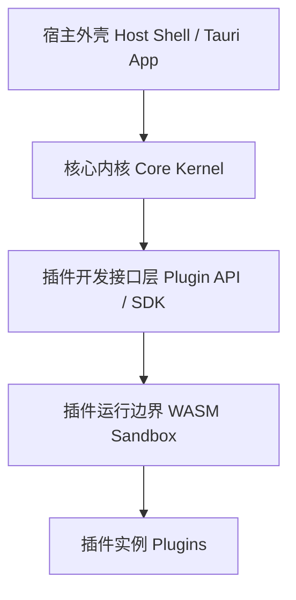
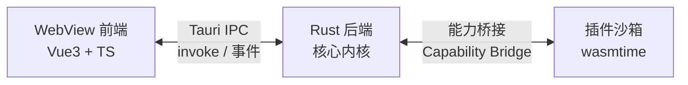
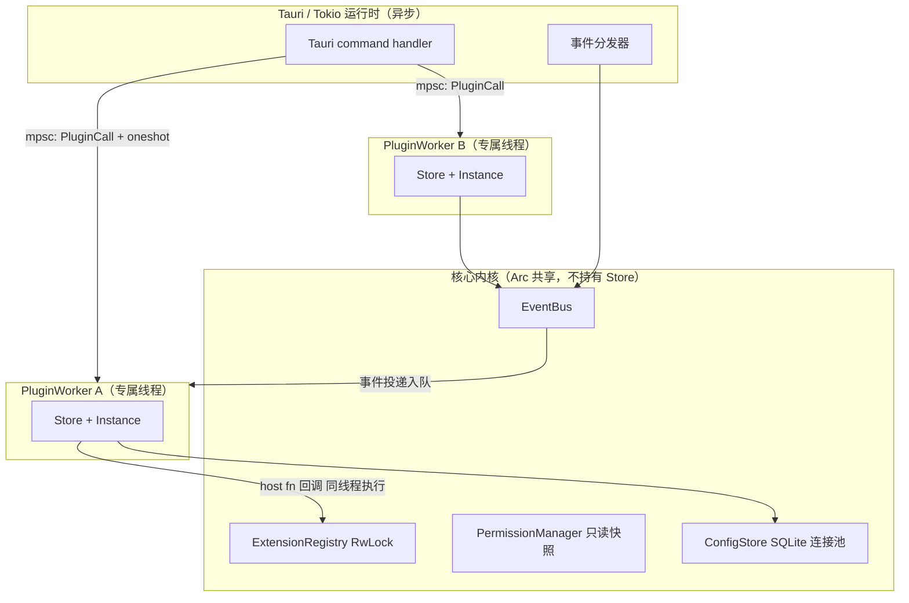
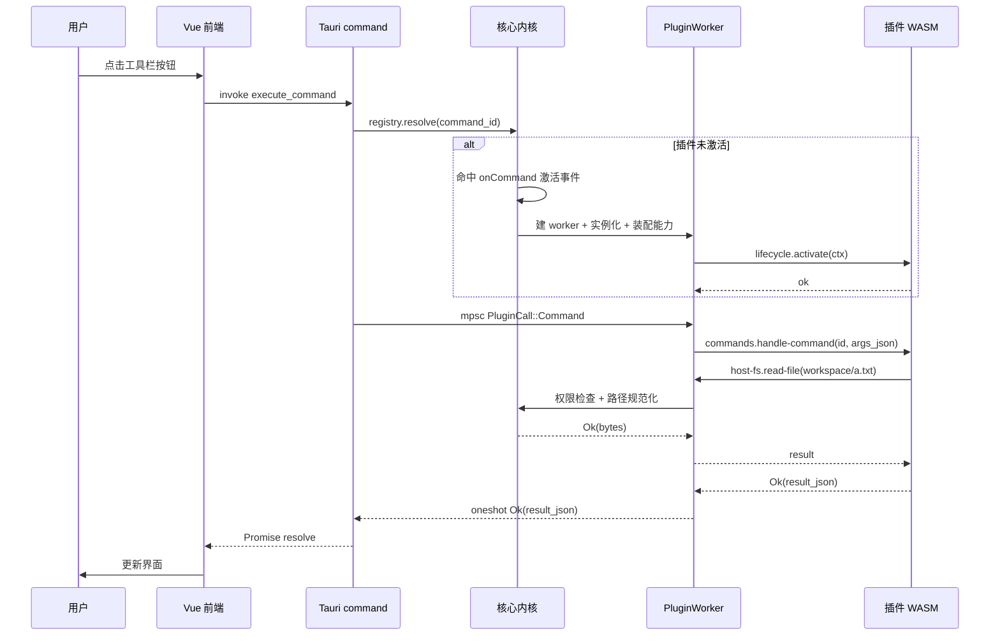
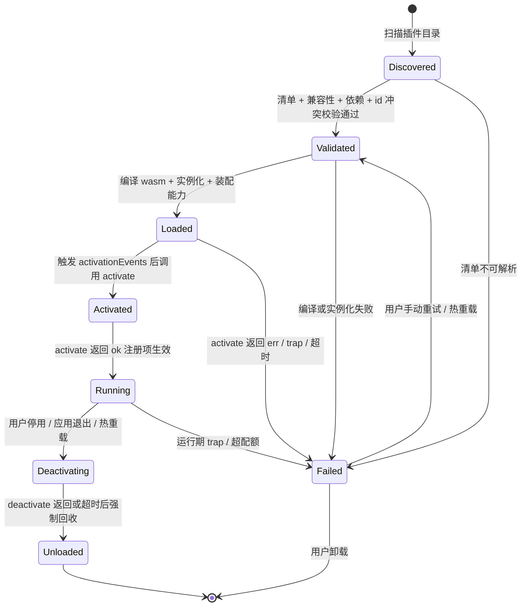
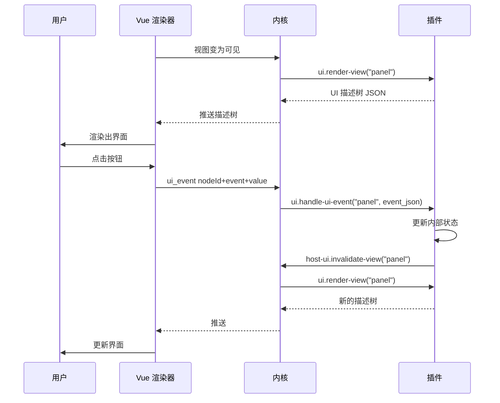
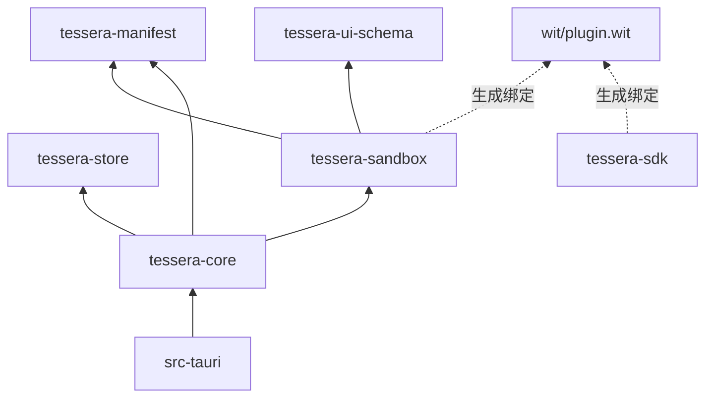

# Tessera — 桌面插件化工具核心 · 架构设计书

**版本**：v0.3（契约收敛稿）
**状态**：核心架构已确定；跨模块共享契约已收敛；应用领域待明确
**更新日期**：2026-08-20
**上一版**：v0.2（存档于 `docs/plugin-core-architecture-design.v0.2.md`）；v0.1（存档于 `docs/plugin-core-architecture-design.v0.1.md`）

---

## 0. 本版变更说明

v0.2 把架构细化到了可开工粒度。在按 §18 拆分实施任务的过程中，发现文档内部存在若干**跨模块共享契约**上的矛盾与盲区——这类问题若留到实现期才暴露，会导致多个模块回头返工。v0.3 逐项收敛这些契约，**不推翻任何 v0.2 的架构决策**。

### 本版修订

| 编号 | 变更 | 涉及章节 |
|---|---|---|
| A1 | **网络权限拆为三种独立类型** `net.http` / `net.insecure` / `net.private`，互不隐含。删除 v0.2 内嵌的 `allowInsecure` / `allowPrivateNetwork` 两个 flag——它们从未出现在清单 schema 中，`additionalProperties: false` 下声明了反而会被拒 | §1.5 §7.1 §7.3 §7.4 §12.1 |
| A2 | **清单 schema 改为从 Rust 类型生成**。校验真值移到 Rust 侧（serde tagged enum + `deny_unknown_fields`），`plugin.schema.json` 降级为服务编辑器补全的生成物。v0.2 手写的 schema 骨架与 §4.1 示例互不兼容，且缺三个权限分支 | §4.3 §4.4 §17.1 |
| A3 | **`views[].kind` 正式进入契约**，enum 当前只有 `declarative` 一个值。v0.2 §9.6 声称此接口位「已预留」，但它从未出现在 schema 中——在 `additionalProperties: false` 下等于没有预留 | §4.1 §4.2 §6.1 §9.5 §9.6 |
| A4 | **配置项 `sensitive` 正式进入契约**，并把「这不是加密」从一句文档说明升级为 UI 实现约束 | §4.1 §11.1 §11.5 §12.2 §16 |
| A5 | **`engines.core` 改为整数能力级别 `CORE_API_LEVEL`**，与应用展示版本彻底解耦。v0.2 把插件兼容性契约绑在应用 SemVer 上，导致宿主每次发版都可能误伤插件，且 0.x 阶段无法正常工作 | §4.1 §4.2 §4.4 §5.2 §13.1 §13.2 §13.3 附录 A/B |
| A6 | **WIT 版本纪律的生效起点定为 M1**。`tessera:plugin@0.2.0` 在此之前视为未发布状态，WIT 修改不递增版本号（本版给 `activation-context` 加 `core-api-level` 字段即属此类）。同时更正兼容性判定规则——v0.2 的「给 record 加可选字段 → minor」在 WIT 里不成立，WIT 的 record 没有可选字段这个概念 | §13.1 §13.2 §18 |
| B1 | **新增全局等待图**。v0.2 的 `CallChain` 只能检测单条调用链上的环，检测不到两条独立调用链的并发互等——该场景下双方各冻结 30s，且因调用串行化会连带冻结面板渲染 | §2.3 §12.1 §12.3 §17.1 |
| B2 | **事件 ring 的创建时刻提前到「决定激活」**。v0.2 未定义激活窗口内到达的事件归宿——那时 worker 与队列都还不存在 | §3.2 §5.3 §10.3 §10.4 |
| B3 | **`file-picker` 改为数据交付模型**，插件永不持有路径、不需要 fs 权限。v0.2 的「临时授予一次性读权限」与 §2.3 的权限快照不可变性冲突，且撞上 §7.4 的 linker 装配——未声明 `fs.*` 的插件根本没有 `read-file` 符号，临时授权无处落地 | §7.1 §9.2 §9.4 §11.4 §11.5 |
| B4 | **删除 `onConfig:` 激活事件**。v0.2 定义它在「读取配置项」时触发，而设置面板要读取全部插件的配置项——这会导致打开设置即激活所有插件，与 §3.4 懒激活的目标直接冲突。改用 `onEvent:core/config-changed` 覆盖 | §3.4 §4.2 §11.1 |

### 随修订一并定死的细则

| 细则 | 结论 | 出处 |
|---|---|---|
| 重定向能否跨网络权限类型 | **不能**。每一跳必须落在发起时那个权限类型的白名单内 | §7.3 |
| `net.private` 是否接受 IP 字面量 | **接受**，跳过 IDNA 归一化直接比对；不引入 CIDR | §7.3 |
| `manifestVersion` 何时 +1 | 仅破坏性结构变化（改字段名 / 删必填字段 / 改字段类型）。**新增可选字段不递增**——本版加的 `kind` 与 `sensitive` 都不触发 | §4.2 §13.1 |
| picked token 的失效时机 | 插件停用时清除；同时存活上限 4，超出淘汰最旧；**不设时间过期** | §9.2 §11.5 |
| 插件面板内能否做凭据输入 | **不能**。凭据统一走配置项，`text-input` 不提供 `password` prop | §9.2 §11.5 |

**v0.2 的全部架构决策继续有效**：半可信信任模型、进程内 WASM 沙箱、Component Model + WIT、每插件一线程、全同步阻塞、声明式 UI 描述树。本版只动契约细节，不动这些。

---

## 1. 概述

### 1.1 目标与非目标

**目标**：设计一个提供标准插件开发接口的桌面工具核心。内核保持薄、稳定、通用，绝大多数业务功能通过插件契约挂载；插件之间、插件与宿主之间的耦合可控、故障可隔离、接口可长期演进。

**非目标**（当前阶段明确不做，避免范围蔓延）：

- 不做通用应用平台。内核只提供插件宿主能力，不预置业务领域模型
- 不做在线插件市场（§19 TODO）
- 不做多语言一等 SDK。WASM 本身语言无关，但 MVP 只保证 Rust 侧开发体验
- 不防御蓄意恶意插件（见 §1.4）
- 不做移动端 / Web 端

### 1.2 技术栈

| 层次 | 选型 | 版本约束 |
|---|---|---|
| 桌面应用框架 | Tauri | 2.x |
| 核心 / 后端语言 | Rust | edition 2024 |
| 前端 | Vue 3 + TypeScript | Vue 3.4+ / TS 5.x |
| 插件隔离 | wasmtime（WASM Component Model） | 支持 component model + WASI 0.2 的版本 |
| 插件接口描述 | WIT + wit-bindgen | — |
| 插件编译目标 | `wasm32-wasip2` | — |
| 本地存储 | SQLite（经 `rusqlite`，bundled 特性） | — |

### 1.3 选型依据（摘要）

- **Rust + Tauri 2**：团队 C#/C++ 经验都不深，与其分散精力，不如统一投入学习 Rust；额外收益是 Rust 与 wasmtime（本身即 Rust 项目）之间的插件沙箱集成摩擦最小。
- **WASM 沙箱**：在"进程内直接调用 / 进程内沙箱 / 进程外独立进程"三种插件隔离方案中，选择进程内沙箱这一折中方案，兼顾隔离性与实现复杂度；沙箱后端选定 WASM（而非 V8 isolate / QuickJS），因为语言无关、能力安全模型天然、且与 Rust 宿主协同成本最低。
- **Component Model 而非裸 core wasm**：WIT 提供带类型的接口契约与稳定 ABI，字符串、record、variant、result 不用自己在线性内存里手搓编解码；代价是工具链相对新，需要跟进 wasmtime 版本。
- **Vue 3**：Tauri 对前端框架无感知，选 Vue 3 主要基于团队既有经验，与 React 相比无原则性优劣。

### 1.4 信任模型（v0.2 新增决策）

**采用"半可信"假设**：插件来源可控（自研 + 少量已知合作方），沙箱的首要目标是**故障隔离与资源限额**，而非对抗蓄意攻击者。

这条假设的直接推论：

**做**（成本低、收益明确）：

- 能力最小化：未授权的宿主函数根本不导入插件实例，插件代码里"看不见"
- 资源限额：内存上限、执行时长上限、存储配额，超限强制中断
- 路径逃逸防护：虚拟目录规范化后校验前缀（防的是"插件写错了路径"而非"插件想越狱"）
- 域名白名单 + 私有网段默认拒绝：防的是配置疏漏与误访问
- 故障隔离：单个插件 trap / 死循环 / panic 不影响宿主与其他插件

**不做**（半可信模型下明确接受的风险，写在这里是"已知并接受"而非"没想到"）：

| 不防御项 | 说明 |
|---|---|
| 侧信道与时序攻击 | 进程内沙箱天然无法防御 Spectre 类攻击 |
| host 函数自身缺陷导致的进程崩溃 | 宿主原生代码 panic 会拖垮整个进程，容错天花板低于进程外方案 |
| 文件访问的 TOCTOU 竞态 | 路径校验与实际打开之间存在时间窗 |
| 授权范围内的滥用 | 插件把白名单域名当外传通道，权限系统无法区分 |
| 磁盘耗尽 | 存储配额是软限制，超限拒绝写入但不做实时磁盘监控 |
| 插件包完整性 | MVP 不做签名验签（见 §15） |

如果未来应用领域转向"面向第三方开放"，需要回到这一节重新评估，届时至少要补：强制签名、权限二次确认 UI、供应链校验，并考虑把高风险插件类别挪到独立进程（§8.6）。

### 1.5 关键决策速览

| 决策点 | 选择 | 出处 |
|---|---|---|
| 信任模型 | 半可信：防 bug 不防恶意 | §1.4（v0.2 新增） |
| 插件隔离 | 进程内 WASM 沙箱（wasmtime） | §8 |
| 组件模型 | Component Model + WIT，非裸 core wasm | §5 |
| 桌面框架 | Tauri 2 | §2.2 |
| 核心语言 | Rust | — |
| 前端框架 | Vue 3 + TypeScript | §9 |
| 线程模型 | 每激活插件一个专属 worker 线程 | §2.3（v0.2 新增） |
| 宿主服务调用 | 全同步阻塞 | §2.3（v0.2 新增） |
| 结构化数据编码 | JSON 字符串；二进制才用 `list<u8>` | §5.4（v0.2 新增） |
| 文件系统权限 | 精确到虚拟目录别名 | §7.2 |
| 网络权限 | 三类独立权限（https 公网 / 明文 / 私有网段）+ 域名白名单 | §7.3（v0.3 修订） |
| id 冲突处理 | 拒绝加载 + 报错，不做静默覆盖 | §6.2 |
| UI 扩展 | 声明式 UI 描述树，插件不碰 DOM | §9（v0.2 新增） |
| 面板系统（MVP） | 四停靠位 docking + tab 分组 | §9.5 |
| 事件投递 | 异步、至多一次、按发布者 FIFO | §10（v0.2 新增） |
| 配置存储 | 本地 SQLite（WAL），不额外起数据库服务 | §11 |
| 宿主兼容性契约 | 整数能力级别 `CORE_API_LEVEL`，与应用版本解耦 | §13.1（v0.3 修订） |
| 清单校验真值 | Rust 类型（serde），JSON Schema 为生成物 | §4.3（v0.3 修订） |
| 用户选定文件的交付 | 数据交付（经 host-storage 保留 key），不授予 fs 权限 | §9.2（v0.3 修订） |
| 插件开发热重载 | 仅重载变更的 WASM 模块 | §14.1 |
| 遥测 / 崩溃上报 | 默认不采集 | §16 |
| 插件签名 | MVP 不做 | §1.4 / §15 |
| 插件市场 / 多语言 SDK | TODO，暂不实现 | §19 |
| 插件测试脚手架 | TODO，暂不实现 | §19 |

---

## 2. 总体架构

### 2.1 分层

自底向上五层：

1. **宿主外壳（Host Shell / Tauri App）**：应用入口、窗口管理、启动与退出流程、Tauri command 注册
2. **核心内核（Core Kernel，Rust）**：插件管理器、扩展注册表、服务注册表、事件总线、权限管理器、配置中心
3. **插件开发接口层（Plugin API / SDK）**：WIT world 定义的契约、扩展点 schema、宿主服务接口——一旦发布需谨慎变更
4. **插件运行边界（WASM Sandbox）**：wasmtime 承载的独立线性内存空间 + 能力桥接
5. **插件实例（Plugins）**：具体功能模块



### 2.2 Tauri 进程结构

Tauri 应用是单个操作系统进程，内部三方共存：



两层边界性质不同：

- **WebView ↔ Rust 后端**：普通的进程内 API 边界（Tauri IPC）。前端是宿主自己的代码，可信；此处不做安全校验，只做参数合法性校验。
- **Rust 后端 ↔ 插件沙箱**：**安全边界**（能力桥接）。插件只能看到宿主显式授权的能力，所有跨界调用都要做权限与配额检查。

### 2.3 并发与线程模型（v0.2 新增）

这是"全同步阻塞"决策的直接后果，也是实现中最容易踩坑的地方，因此单列一节。

**约束前提**：`wasmtime::Store` 是 `!Sync`，且实例与其 Store 绑定，不能跨线程并发使用。

**模型：每个已激活插件拥有一个专属 OS 线程（PluginWorker）**



**要点**：

1. **调用入站**：调用方（Tauri command handler、事件分发器、其他插件）向目标插件的 `mpsc::Sender<PluginCall>` 投递请求，附带一个 `oneshot::Sender` 用于回传结果。异步侧 `await` 该 oneshot，**不阻塞 tokio 执行器**。
2. **worker 循环**：worker 线程从 channel 取请求，在自己的 Store 上同步调用 WASM 导出函数，返回结果。同一插件的调用天然串行化——插件作者不需要考虑自身的并发安全，这是"每插件一线程"顺带的重要简化。
3. **宿主服务出站**：host 函数在**插件自己的 worker 线程上**执行，因此可以放心做同步阻塞 I/O（读文件、发 HTTP）。阻塞的是该插件的专属线程，UI 与其他插件不受影响。这正是"全同步"方案成立的前提。
   - 若 host 实现内部用异步库（如 `reqwest` 异步版），在 host 函数里用 `tokio::runtime::Handle::block_on` 把结果同步化。**注意**：不能在 tokio worker 线程上 `block_on`，而 PluginWorker 是独立 OS 线程、不属于 tokio 池，因此安全。
4. **内核共享状态**：`ExtensionRegistry`、`ConfigStore`、`EventBus` 通过 `Arc` 放进 `HostState`，host 函数直接访问。写操作走 `RwLock`，锁粒度要细——**绝不能在持锁期间调用 WASM**，否则插件里的一次慢操作会卡住全局注册表。
5. **权限快照**：`PermissionManager` 在实例化时把该插件的授权解析成不可变的 `GrantedCapabilities` 快照，放进 `HostState`。运行期权限检查是纯内存比对，不加锁、不查库。权限变更需要重启该插件实例。

**插件间互调与死锁防护**：

插件 A 的命令处理中调用插件 B 的命令时，A 的线程会阻塞等待 B 的 oneshot。若 B 又回调 A，则死锁。防护分两层：

**第一层 · 调用链检测（`CallChain`）**

- 每次跨插件调用携带一个 `CallChain`（`Vec<PluginId>`，随调用请求传递）
- 派发前检查目标 id 是否已在链上——是则立即返回 `E_CALL_CYCLE`，不派发
- 链长超过 `MAX_CALL_DEPTH`（默认 8）同样拒绝，返回 `E_CALL_DEPTH`

**第二层 · 全局等待图（v0.3 新增）**

`CallChain` 只能发现**同一条调用链上的环**，发现不了两条独立调用链的并发互等：

```
   t0   UI 触发 A 的命令 X              │   UI 触发 B 的命令 Y
        ↓                               │   ↓
   t1   A 的 worker 执行 X              │   B 的 worker 执行 Y
        调 B，chain=[A]，目标 B         │   调 A，chain=[B]，目标 A
        B 不在 [A] 里 → 放行            │   A 不在 [B] 里 → 放行
        ↓                               │   ↓
   t2   A 阻塞等 B 的 oneshot           │   B 阻塞等 A 的 oneshot
        B 的 channel 里躺着 A 的请求    │   A 的 channel 里躺着 B 的请求
        但 B 的 worker 正阻塞，不消费   │   但 A 的 worker 正阻塞，不消费
        └──────────── 互等 ─────────────┘
```

两条链各自都无环，第一层检测不到。而由于同一插件的调用天然串行（本节要点 2），一次互等会把**两个插件的全部功能连同它们的面板渲染**一起冻结到超时为止。因此补第二层：

- 宿主维护一张全局等待图 `Mutex<HashMap<PluginId, PluginId>>`，记录「谁在等谁」
- A 发起对 B 的调用前写入边 `A → B`，拿到结果（或超时）后移除
- 派发前从目标 B 出发沿边遍历，若能到达调用者 A → 立即返回 `E_CALL_DEADLOCK`
- 图的规模是「当前处于跨插件调用中的插件数」，通常个位数，遍历成本可忽略
- 加锁只发生在调用的进出两点，临界区极短，**不在 WASM 执行期间持锁**（符合本节要点 4）

**兜底超时**：每次跨插件调用仍附带超时（默认 30s），超时返回 `E_TIMEOUT_CALL`。有了等待图之后，它的职责降为「兜住对方真的很慢」，不再承担死锁兜底。

**附带收益**：等待图本身是可观测性数据，插件管理界面可以直接显示「A 正在等待 B」（§12.3）。

**线程数量**：MVP 接受"每插件一线程"。桌面场景下同时激活的插件通常在几十个量级，OS 线程开销可接受，且懒激活（§3.4）保证未使用的插件根本不占线程。若插件数量突破量级，改为"线程池 + 实例绑定池化"，见 §19 TODO。

### 2.4 端到端调用链路（v0.2 新增）

以"用户点击工具栏按钮触发插件命令"为例：



---

## 3. 插件生命周期

### 3.1 状态机



与 v0.1 的差异：`Error` 改名 `Failed` 并**允许恢复**（重试 / 热重载回到 `Validated`），而不是单向终结——否则开发期每次插件崩溃都要重启应用。

### 3.2 状态转移表

| 起始态 | 事件 | 目标态 | 副作用 |
|---|---|---|---|
| — | 目录扫描发现 manifest | `Discovered` | 记录路径 |
| `Discovered` | 校验流水线通过（§4.4） | `Validated` | 声明式贡献预注册到注册表（灰态，不可调用） |
| `Discovered` | 校验失败 | `Failed` | 记录错误码 + 人类可读原因 |
| `Validated` | 激活事件命中 | `Loaded` | **先建事件 ring 与 `PluginCall` channel**（§10.3），再编译 component、创建 Store、按权限装配 linker、创建 worker 线程 |
| `Validated` | 实例化失败 | `Failed` | 销毁 Store，回滚预注册 |
| `Loaded` | `activate()` 成功 | `Activated` → `Running` | 预注册项转为可用态；编程式注册生效 |
| `Loaded` | `activate()` 返回 err / trap / 超时 | `Failed` | 回滚该插件所有注册项，销毁 Store 与 worker；丢弃 ring 与 channel，队列中未投递事件计入 `events_dropped` |
| `Running` | trap / 超内存 / 超时 | `Failed` | 同上；向前端推送失败通知 |
| `Running` | 停用请求 | `Deactivating` | 关闭入站 channel，停止派发新调用 |
| `Deactivating` | `deactivate()` 返回或超时 | `Unloaded` | 注销所有注册项、关闭 worker、销毁 Store |
| `Failed` | 用户重试 / 文件变更 | `Validated` | 重走校验流水线 |

**两条关键不变式**：

- 一个插件在注册表中的所有条目（命令、视图、菜单项、订阅）与其状态**原子同步**——插件离开 `Running` 时，其所有条目必须在同一次写锁内全部移除，不允许出现"命令还在但插件没了"的中间态。
- `Failed` 状态的 Store **必须销毁重建**，不能复用。WASM trap 后线性内存状态不可信（见 §8.4）。

### 3.3 依赖解析与加载顺序

`dependencies` 字段声明插件间依赖。处理流程：

1. **建图**：以所有 `Validated` 插件为节点，`dependencies` 为有向边（A 依赖 B → 边 A→B）
2. **缺失检查**：依赖的 plugin id 不存在，或版本不满足 SemVer 区间 → 依赖方进入 `Failed`，错误码 `E_DEPS_MISSING` / `E_DEPS_VERSION`
3. **环检测**：Tarjan 强连通分量。任何 size > 1 的 SCC 或自环 → 环上**所有**插件进入 `Failed`，错误码 `E_DEPS_CYCLE`，错误信息中列出完整环路径
4. **拓扑排序**：得到激活顺序。激活 A 前必须先激活其所有依赖
5. **级联失败**：依赖 B 激活失败 → 所有（直接或间接）依赖 B 的插件进入 `Failed`，错误码 `E_DEPS_UPSTREAM_FAILED`，并注明根因插件 id
6. **停用顺序**：拓扑逆序。停用 B 前先停用所有依赖 B 的插件

**依赖不等于能调用**：`dependencies` 只保证加载顺序与存在性。跨插件调用仍需 `command.invoke` 权限（§7.1）。

### 3.4 激活事件目录

| 事件 | 语法 | 触发时机 |
|---|---|---|
| 命令触发 | `onCommand:{command_id}` | 该命令被调用（来自 UI、快捷键或其他插件） |
| 视图打开 | `onView:{view_id}` | 该视图首次可见 |
| 事件订阅 | `onEvent:{topic}` | 该 topic 有事件发布 |
| 启动完成 | `onStartup` | 应用启动完成后（**延迟到首帧渲染之后**，不阻塞冷启动） |
| 依赖激活 | 隐式 | 被其他插件依赖且该插件被激活 |
| 无条件 | `*` | 立即激活。**仅供开发调试**，正式插件使用应报 lint 警告 |

> **v0.3 移除了 `onConfig:{key}`**。它原定在「读取配置项」时触发，但设置面板需要读取全部插件的配置项，那会导致打开设置即激活所有插件，与懒激活的目标直接冲突。而配置项的读取本就不需要插件参与——未设置过的 key 返回清单里的 `default`（§11.1）。需要对配置变更做出反应的插件改用 `onEvent:core/config-changed`，自行按 payload 中的 `pluginId` 过滤。

**懒激活的意义**：宿主启动时只做清单解析与声明式贡献预注册，不执行任何插件代码。启动耗时与插件数量的关系从 O(n × 插件初始化耗时) 降为 O(n × 清单解析耗时)。

**预注册（灰态）语义**：`Validated` 后，`contributes` 中声明的命令、视图、菜单项已进入注册表并对 UI 可见（菜单项可以正常显示出来），但状态标记为"未激活"。用户真正触发时，先激活插件再派发调用。这是懒激活能对用户无感的关键。

### 3.5 停用与资源回收

```
1. 关闭入站 channel，拒绝新调用（返回 E_PLUGIN_DEACTIVATING）
2. 等待在途调用完成，上限 DRAIN_TIMEOUT（默认 5s）
3. 调用 deactivate()，上限 DEACTIVATE_TIMEOUT（默认 2s）
4. 无论第 3 步结果如何：注销所有注册项 → 取消所有事件订阅 → drop Store → join worker
5. 若 worker 在 JOIN_TIMEOUT（默认 1s）内未退出（插件在 deactivate 里死循环）：
   通过 epoch 中断强制 trap，detach 线程并记录泄漏计数
```

**插件私有 KV 数据不随停用清除**（存在 SQLite，见 §11.4），仅在用户显式卸载插件时删除。内存态一律丢失。

---
## 4. 插件清单（Manifest）

### 4.1 完整示例

文件名固定为 `plugin.json`，与 `main` 指向的 wasm 文件同处一个插件目录。

```json
{
  "manifestVersion": 1,
  "id": "com.example.myplugin",
  "name": "My Plugin",
  "version": "1.2.0",
  "description": "一句话说明插件做什么",
  "author": "Example Inc.",
  "license": "MIT",
  "engines": {
    "core": 1,
    "pluginApi": "^0.2.0"
  },
  "main": "plugin.wasm",
  "icon": "icon.svg",
  "activationEvents": [
    "onCommand:com.example.myplugin.run",
    "onView:com.example.myplugin.panel"
  ],
  "permissions": [
    { "type": "fs.read",  "virtualDir": "workspace" },
    { "type": "fs.write", "virtualDir": "plugin-data" },
    { "type": "net.http", "allowedDomains": ["api.example.com", "*.cdn.example.com"] },
    { "type": "net.private", "allowedDomains": ["gitlab.internal", "10.0.0.5"] },
    { "type": "events.subscribe", "topics": ["core/workspace-changed"] },
    { "type": "command.invoke", "targets": ["com.example.other.format"] }
  ],
  "dependencies": {
    "com.example.other": "^1.0.0"
  },
  "contributes": {
    "commands": [
      { "id": "run", "title": "运行我的插件", "icon": "play", "category": "My Plugin" }
    ],
    "menus": {
      "toolbar":      [{ "command": "run", "group": "navigation", "order": 10 }],
      "view/title":   [{ "command": "run", "when": "view == com.example.myplugin.panel" }],
      "context":      []
    },
    "views": [
      { "id": "panel", "name": "My Panel", "location": "right", "icon": "layers", "order": 20, "kind": "declarative" }
    ],
    "keybindings": [
      { "command": "run", "key": "ctrl+alt+r", "mac": "cmd+alt+r" }
    ],
    "configuration": {
      "title": "My Plugin",
      "properties": {
        "endpoint": {
          "type": "string",
          "default": "https://api.example.com",
          "description": "后端接口地址"
        },
        "maxRetries": {
          "type": "integer", "default": 3, "minimum": 0, "maximum": 10,
          "description": "失败重试次数"
        },
        "apiKey": {
          "type": "string", "default": "", "sensitive": true,
          "description": "接口密钥（明文存储，见 §11.5）"
        }
      }
    },
    "eventSubscriptions": ["core/workspace-changed"]
  }
}
```

### 4.2 字段规范

| 字段 | 类型 | 必填 | 校验规则 |
|---|---|---|---|
| `manifestVersion` | integer | 是 | 当前仅接受 `1`。清单结构本身的版本，与插件版本、宿主版本无关。**仅在破坏性结构变化时 +1**（改字段名 / 删必填字段 / 改字段类型）；新增可选字段不递增 |
| `id` | string | 是 | 反向域名格式，正则 `^[a-z0-9]+(\.[a-z0-9-]+)+$`，长度 ≤ 128。全局唯一 |
| `name` | string | 是 | 展示名，长度 ≤ 64 |
| `version` | string | 是 | 严格 SemVer 2.0.0 |
| `description` | string | 否 | 长度 ≤ 256 |
| `author` / `license` | string | 否 | 纯展示用途 |
| `engines.core` | integer | 是 | 插件要求的**最低宿主能力级别**，正整数。加载前与宿主的 `CORE_API_LEVEL` 比较（§13.1）。**不是应用版本号** |
| `engines.pluginApi` | string | 是 | SemVer 区间，校验 WIT world 版本（§13.1） |
| `main` | string | 是 | 相对插件目录的路径，必须以 `.wasm` 结尾，**不得包含 `..` 或绝对路径** |
| `icon` | string | 否 | 相对路径，SVG 或 PNG，≤ 64 KB |
| `activationEvents` | string[] | 是 | 非空。每项须匹配 §3.4 的语法；引用的 command/view id 必须在 `contributes` 中存在 |
| `permissions` | object[] | 否 | 见 §7.1 权限目录。同一 `type` + scope 不得重复 |
| `dependencies` | map<id, semver-range> | 否 | key 须为合法 plugin id；不得依赖自身 |
| `contributes` | object | 否 | 见 §6.1 扩展点目录 |

**id 的局部/全局两种写法**：`contributes` 内部的 `id` 字段一律写**局部名**（如 `"run"`），宿主在注册时自动拼成全限定 id `com.example.myplugin.run`。`activationEvents`、`menus[].command`、`keybindings[].command` 等引用处：引用本插件的可以写局部名，引用其他插件的必须写全限定名。这样插件改 id 时内部引用不用全改。

### 4.3 校验真值与 schema 生成（v0.3 重写）

v0.2 在此处贴了一份**手写**的 JSON Schema 骨架，同时服务三处：宿主校验、SDK 编译期校验、编辑器补全。这条路走不通——那份 schema 与 §4.1 的完整示例互不兼容（缺 `events.publish` / `events.subscribe` / `command.invoke` 三个权限分支），而且它的 `oneOf` 结构给出的错误信息（「未匹配任何子模式」）恰好违背了 `additionalProperties: false` 的初衷。更根本的问题是：**一份手写的 schema 和一份手写的 Rust 类型必然漂移，且漂移时没有任何东西会报警。**

v0.3 改为单一真值。

**校验真值是 Rust 类型**，位于 `crates/tessera-manifest`：

```rust
#[derive(Deserialize, JsonSchema)]
#[serde(deny_unknown_fields, rename_all = "camelCase")]
pub struct PluginManifest {
    pub manifest_version: u32,
    pub id: PluginId,
    pub version: Version,               // 严格 SemVer
    pub engines: Engines,
    pub main: String,
    pub activation_events: Vec<String>,
    #[serde(default)]
    pub permissions: Vec<Permission>,
    #[serde(default)]
    pub contributes: Contributes,
    // ...
}

#[derive(Deserialize, JsonSchema)]
#[serde(deny_unknown_fields, rename_all = "camelCase")]
pub struct Engines {
    pub core: u32,                      // 宿主能力级别，见 §13.1
    pub plugin_api: VersionReq,         // WIT world 版本区间
}

#[derive(Deserialize, JsonSchema)]
#[serde(tag = "type", deny_unknown_fields, rename_all = "camelCase")]
pub enum Permission {
    #[serde(rename = "fs.read")]          FsRead          { virtual_dir: String },
    #[serde(rename = "fs.write")]         FsWrite         { virtual_dir: String },
    #[serde(rename = "net.http")]         NetHttp         { allowed_domains: Vec<String> },
    #[serde(rename = "net.insecure")]     NetInsecure     { allowed_domains: Vec<String> },
    #[serde(rename = "net.private")]      NetPrivate      { allowed_domains: Vec<String> },
    #[serde(rename = "events.publish")]   EventsPublish   { topics: Vec<String> },
    #[serde(rename = "events.subscribe")] EventsSubscribe { topics: Vec<String> },
    #[serde(rename = "command.invoke")]   CommandInvoke   { targets: Vec<String> },
}
```

`deny_unknown_fields` 承接 v0.2 `additionalProperties: false` 的意图——未知字段直接报错而非静默忽略，插件作者拼错字段名时立刻得到反馈，而不是纳闷「为什么我的配置没生效」。而 serde 能给出的错误信息比 `oneOf` 精确得多：写成 `{"type": "fs.read", "virtualDirectory": "workspace"}` 会得到「`fs.read` 不认识字段 `virtualDirectory`」，直接指向拼写错误本身。

**`plugin.schema.json` 是生成物**：由 `schemars` 从上述类型产出，check-in 到 `crates/tessera-manifest/schema/`，CI 校验「重新生成后与 check-in 内容逐字节一致」。它的**唯一用途是编辑器补全**（VS Code 的 `json.schemas` 配置），**不是校验入口**——任何依赖它做校验的代码都是错的。

这与 §17.2 对 TS 类型的处理是同一条原则（生成物、纳入 git 以便 review 契约变更、不手写不手改），已提升为 §17.1 的硬性约束 5。

> **实现风险，需在开工首日验证**：serde 的 internally tagged enum（`#[serde(tag = "type")]`）在分发到具体 variant 之前会先缓冲 Content，历史上与 `deny_unknown_fields` 的组合存在行为不一致。`tessera-manifest` 的**第一个测试用例**就应该是一个未知字段的反例（如上面的 `virtualDirectory`），确认它真的报错。若不生效，退路是给每个 variant 的载荷结构体单独标注，或改用 adjacently tagged 表示。

### 4.4 校验流水线

`Discovered → Validated` 之间按顺序执行，任一步失败即进入 `Failed` 并记录错误码：

| 步骤 | 检查内容 | 失败错误码 |
|---|---|---|
| 1 | `plugin.json` 存在且是合法 JSON | `E_MANIFEST_PARSE` |
| 2 | serde 反序列化通过，含未知字段拒绝（§4.3） | `E_MANIFEST_SCHEMA` |
| 3 | `manifestVersion` 受支持 | `E_MANIFEST_VERSION` |
| 4 | `engines.core` ≤ 宿主 `CORE_API_LEVEL`（§13.1） | `E_COMPAT_CORE` |
| 5 | `engines.pluginApi` 匹配当前 WIT world 版本 | `E_COMPAT_API` |
| 6 | `main` 路径合法且文件存在 | `E_MANIFEST_MAIN` |
| 7 | `id` 未与已加载插件冲突 | `E_CONFLICT_PLUGIN_ID` |
| 8 | `contributes` 内所有 id 在全局注册表中无冲突 | `E_CONFLICT_CONTRIB_ID` |
| 9 | `activationEvents` 引用的 id 均存在 | `E_MANIFEST_DANGLING_REF` |
| 10 | `permissions` 声明的虚拟目录别名已在宿主注册 | `E_PERM_UNKNOWN_VDIR` |
| 11 | 依赖存在性与版本（§3.3） | `E_DEPS_MISSING` / `E_DEPS_VERSION` |
| 12 | 依赖图无环（§3.3） | `E_DEPS_CYCLE` |

第 7–8 步的冲突检查在**全局写锁下一次性完成**：先在临时集合中试注册全部条目，全部通过才提交，任一冲突则整体回滚。避免"注册到一半发现冲突"留下脏数据。

---

## 5. 核心接口定义

插件以 WASM Component 形式运行，接口通过 WIT 定义，宿主侧用 `wit-bindgen` 生成绑定。WIT 文件是**唯一事实来源**，放在仓库根的 `wit/` 目录，宿主与 SDK 共用同一份。

### 5.1 接口分域与版本化

v0.1 把所有宿主服务塞进一个 `host-services` interface。v0.2 按能力域拆分，理由有二：一是**权限装配的粒度就是 interface 粒度**，未授权的域整个不 link，插件里连符号都没有；二是后续增删函数时，改动被限制在单个 interface 内，版本演进影响面小。

```
package tessera:plugin@0.2.0;

interface types        —— 共享类型：错误 variant、日志级别、句柄
interface host-log     —— 日志与通知             【默认授予】
interface host-registry—— 编程式注册命令/视图    【默认授予】
interface host-config  —— 读写本插件配置项       【默认授予】
interface host-storage —— 插件私有 KV 存储       【默认授予】
interface host-events  —— 事件发布/订阅          【需 events.* 权限】
interface host-fs      —— 虚拟目录文件访问       【需 fs.* 权限】
interface host-net     —— HTTP 请求              【需 net.http 权限】
interface host-command —— 调用其他插件的命令     【需 command.invoke 权限】
interface host-ui      —— 请求重绘视图           【贡献了 views 才授予】
```

**"默认授予"的四个 interface** 不涉及沙箱外的资源，无需在 manifest 声明。其余按 §7.4 装配。

### 5.2 WIT 定义

完整定义见附录 A，此处摘录核心部分：

```wit
package tessera:plugin@0.2.0;

interface types {
  variant host-error {
    permission-denied(string),   // 未授权：缺少对应 permission 声明
    not-found(string),           // 目标不存在：文件、配置项、命令 id
    invalid-argument(string),    // 参数不合法：路径含 ..、URL 解析失败
    io-error(string),            // 底层 I/O 失败
    network-error(string),       // DNS / 连接 / TLS / 超时
    quota-exceeded(string),      // 超出存储、响应体或调用深度配额
    unavailable(string),         // 目标插件未激活或正在停用
    internal(string),            // 宿主内部错误，插件无法处理
  }

  record plugin-error {
    code: string,                // 插件自定义错误码，建议带插件 id 前缀
    message: string,             // 面向用户的说明
    details: option<string>,     // 面向开发者的细节，JSON 字符串
  }

  enum log-level { trace, debug, info, warn, error }
}

interface host-fs {
  use types.{host-error};
  // virtual-path 形如 "workspace/sub/a.txt"，第一段是虚拟目录别名
  read-file:   func(virtual-path: string) -> result<list<u8>, host-error>;
  write-file:  func(virtual-path: string, data: list<u8>) -> result<_, host-error>;
  list-dir:    func(virtual-path: string) -> result<list<string>, host-error>;
  file-exists: func(virtual-path: string) -> result<bool, host-error>;
  delete-file: func(virtual-path: string) -> result<_, host-error>;
}

interface host-net {
  use types.{host-error};
  record http-request {
    method: string,                        // GET/POST/PUT/DELETE/PATCH/HEAD
    url: string,
    headers: list<tuple<string, string>>,
    body: option<list<u8>>,
    timeout-ms: option<u32>,               // 上限由宿主钳制
  }
  record http-response {
    status: u16,
    headers: list<tuple<string, string>>,
    body: list<u8>,
  }
  fetch: func(req: http-request) -> result<http-response, host-error>;
}

interface host-ui {
  use types.{host-error};
  // 通知宿主某视图需要重绘；宿主随后回调 ui.render-view
  invalidate-view: func(view-id: string) -> result<_, host-error>;
  show-message:    func(level: string, text: string);
}

// —— 插件必须导出的接口 ——

interface lifecycle {
  use types.{plugin-error};
  record activation-context {
    plugin-id: string,
    plugin-version: string,
    core-version: string,        // 应用展示版本，仅供日志与展示
    core-api-level: u32,         // 宿主能力级别，用于特性检测（§13.1）
    is-dev-mode: bool,
  }
  activate:   func(ctx: activation-context) -> result<_, plugin-error>;
  deactivate: func() -> result<_, plugin-error>;
}

interface commands {
  use types.{plugin-error};
  // args / 返回值均为 JSON 字符串，见 5.4
  handle-command: func(command-id: string, args: string) -> result<string, plugin-error>;
}

interface events {
  on-event: func(topic: string, payload: string);
}

interface ui {
  use types.{plugin-error};
  render-view:      func(view-id: string) -> result<string, plugin-error>;          // 返回 UI 描述树 JSON
  handle-ui-event:  func(view-id: string, event: string) -> result<_, plugin-error>; // event 为 JSON
}

world plugin {
  import host-log;
  import host-registry;
  import host-config;
  import host-storage;
  import host-events;
  import host-fs;
  import host-net;
  import host-command;
  import host-ui;

  export lifecycle;
  export commands;
  export events;
  export ui;
}
```

**关于"必须导出四个接口"**：WIT 的 world export 是强制的，不实现某个接口的插件无法实例化。这里不为每种组合拆 world（组合爆炸），而是**由 Rust SDK 的宏提供默认空实现**——插件只写自己关心的接口，`tessera_sdk::plugin!` 宏补齐其余为 no-op。多语言 SDK 未来需要各自提供等价的默认实现。

### 5.3 宿主侧类型（Rust）

```rust
// crates/tessera-core/src/types.rs

#[derive(Clone, Debug, PartialEq)]
pub enum PluginState {
    Discovered,
    Validated,
    Loaded,
    Activated,
    Running,
    Deactivating,
    Unloaded,
    Failed { code: ErrorCode, reason: String, at: SystemTime },
}

/// 内核持有的插件句柄。注意：这里**不持有** Store 或 Instance——
/// 那些归 PluginWorker 线程独占（见 §2.3）。
pub struct PluginHandle {
    pub plugin_id: PluginId,
    pub manifest: PluginManifest,
    pub state: PluginState,
    pub install_path: PathBuf,
    /// 向该插件 worker 投递调用的入口。
    /// None            = 尚未开始激活
    /// Some + worker=None = 激活进行中（channel 与事件 ring 已建，worker 未起，见 §10.3）
    pub call_tx: Option<mpsc::Sender<PluginCall>>,
    pub worker: Option<JoinHandle<()>>,
}

pub enum PluginCall {
    Activate  { ctx: ActivationContext, reply: oneshot::Sender<Result<(), PluginError>> },
    Deactivate{ reply: oneshot::Sender<Result<(), PluginError>> },
    Command   { id: CommandId, args: String, chain: CallChain,
                reply: oneshot::Sender<Result<String, PluginError>> },
    Event     { topic: String, payload: String },              // 单向，无回复
    RenderView{ view_id: ViewId, reply: oneshot::Sender<Result<String, PluginError>> },
    UiEvent   { view_id: ViewId, event: String },
    Shutdown,
}

pub struct CoreKernel {
    pub plugin_manager:     PluginManager,      // 生命周期编排、依赖图
    pub extension_registry: Arc<RwLock<ExtensionRegistry>>,
    pub service_registry:   Arc<ServiceRegistry>,
    pub event_bus:          Arc<EventBus>,
    pub permission_manager: Arc<PermissionManager>,
    pub config_store:       Arc<ConfigStore>,   // SQLite 承载，见 §11
}

/// 每个 PluginWorker 线程内 Store 携带的状态；host 函数通过它访问内核
pub struct HostState {
    pub plugin_id: PluginId,
    pub caps: GrantedCapabilities,              // 实例化时固化的权限快照
    pub limits: StoreLimits,                    // wasmtime 资源限额
    pub kernel: KernelHandle,                   // 内核的 Arc 集合（弱引用语义）
    pub call_chain: CallChain,                  // 当前调用链，用于死锁检测
}
```

### 5.4 序列化约定（v0.2 新增）

v0.1 的接口里所有载荷都是 `list<u8>`，没说编码。v0.2 明确：

| 数据种类 | 编码 | 理由 |
|---|---|---|
| 命令参数与返回值 | **JSON 字符串**（WIT `string`） | 跨语言一致、可读、便于日志与调试；桌面工具的调用频率下性能不是瓶颈 |
| 事件 payload | **JSON 字符串** | 同上；且事件常需要在日志里肉眼核对 |
| UI 描述树与 UI 事件 | **JSON 字符串** | 前端直接 `JSON.parse`，零转换 |
| 配置值 | **JSON 字符串** | 与 JSON Schema 声明的配置项类型天然对应 |
| 文件内容、HTTP body、KV value | `list<u8>` | 真正的二进制，不做编码假设 |

**为什么不用 WIT record 直接描述命令参数**：命令参数的形状由插件自己定义，宿主不知道也不该知道。用 record 就得为每个命令定义类型，等于把插件的业务类型塞进内核契约。JSON 字符串把这层解耦掉了——宿主只做透传。

**代价**：跨边界要做 JSON 序列化/反序列化，且丢失编译期类型检查。缓解手段是 SDK 侧提供 `#[command]` 属性宏，自动生成 serde 的编解码与类型定义，插件作者写的仍是强类型 Rust 函数。

---

## 6. 扩展点机制

分两种：**声明式**（写在 manifest `contributes` 里，宿主无需执行插件代码即可识别）和**编程式**（`activate()` 中调用 `host-registry` 注册）。

### 6.1 扩展点目录

| 扩展点 | 声明式 | 编程式 | 说明 |
|---|---|---|---|
| `commands` | ✅ | ✅ | 可执行命令。编程式用于运行期才知道数量的场景（如"每个已连接设备一个命令"） |
| `menus` | ✅ | ❌ | 菜单项。挂载位：`toolbar` / `context` / `view/title` / `main/{菜单名}` |
| `views` | ✅ | ❌ | 停靠面板。必须声明式——预注册（灰态）依赖于此。`kind` 字段当前仅接受 `declarative`（§9.6） |
| `keybindings` | ✅ | ❌ | 快捷键。冲突时后注册者失败（§6.2） |
| `configuration` | ✅ | ❌ | 配置项 schema。必须声明式——设置面板要在插件激活前就能显示 |
| `eventSubscriptions` | ✅ | ✅ | 事件订阅。声明式的额外作用是驱动 `onEvent:` 懒激活 |

**为什么大多数扩展点只允许声明式**：懒激活要求宿主在不执行插件代码的前提下就能把 UI 搭出来。菜单项、面板、配置项、快捷键都属于"用户看得见、需要在激活前就存在"的东西。命令与事件订阅例外，因为它们有真实的动态场景。

### 6.2 命名空间与冲突

**命名规则**：所有 command id、view id、配置项 key 强制带插件 id 前缀，格式 `{plugin_id}.{local_name}`。`local_name` 正则 `^[a-zA-Z][a-zA-Z0-9-]*(\.[a-zA-Z][a-zA-Z0-9-]*)*$`。宿主在注册时自动拼接，插件在 manifest 里写局部名（§4.2）。

**冲突处理**：注册时 id 已存在 → **拒绝加载该插件并报错**，不做静默覆盖。前缀规则保证同一 id 冲突只可能来自"同一 plugin id 装了两份"，而这在第 7 步校验（`E_CONFLICT_PLUGIN_ID`）就被拦掉了。

**快捷键是唯一的例外**：`keybindings` 的 key 组合天然跨插件共享命名空间，无法用前缀隔离。策略：先注册者赢，后注册者的该条 binding 被丢弃并记 warning（**不导致插件加载失败**——快捷键冲突不该拖垮整个插件），冲突在设置界面里向用户展示，允许手动改键。

### 6.3 注册表数据结构

```rust
pub struct ExtensionRegistry {
    commands:      HashMap<CommandId, CommandEntry>,
    views:         HashMap<ViewId, ViewEntry>,
    menus:         HashMap<MenuLocation, Vec<MenuEntry>>,   // 按 group/order 排序
    keybindings:   HashMap<KeyChord, CommandId>,
    config_schema: HashMap<PluginId, ConfigSchema>,
    /// 反向索引：插件 → 它注册的所有条目，用于 O(1) 整体注销
    by_plugin:     HashMap<PluginId, PluginEntries>,
}

pub struct CommandEntry {
    pub id: CommandId,
    pub plugin_id: PluginId,
    pub title: String,
    pub icon: Option<String>,
    pub category: Option<String>,
    /// 灰态：插件尚未激活，调用前需先触发激活
    pub activated: bool,
}

pub fn register_command(
    &mut self,
    plugin_id: &PluginId,
    local_name: &str,
    meta: CommandMeta,
) -> Result<CommandId, RegistryError>;

/// 注销该插件的所有条目。必须是原子的（§3.2 不变式）
pub fn unregister_plugin(&mut self, plugin_id: &PluginId) -> PluginEntries;
```

`by_plugin` 反向索引是为了满足 §3.2 的原子注销不变式——没有它，注销时要遍历所有 map，既慢又容易漏。

### 6.4 注册的幂等与回滚

- 编程式注册在 `activate()` 期间进行。`activate()` 若最终返回 err，**该次激活期间的所有注册全部回滚**——实现上先写入一个暂存区，`activate()` 成功后再合并进主注册表。
- 重复注册同一 id（同一插件内）返回 `E_CONFLICT_CONTRIB_ID`，不做覆盖。
- 声明式条目在 `Validated` 时以灰态写入；`activate()` 成功后翻转 `activated = true`。失败则整体移除。

---
## 7. 权限与安全模型

设计目标见 §1.4（半可信模型）。本节给出具体机制。

### 7.1 权限目录

| `type` | scope 字段 | 授予的 interface | 说明 |
|---|---|---|---|
| — | — | `host-log` | 默认授予。日志与消息通知 |
| — | — | `host-registry` | 默认授予。编程式注册 |
| — | — | `host-config` | 默认授予，但只能读写**本插件**贡献的配置项 |
| — | — | `host-storage` | 默认授予，配额见 §11.5 |
| `fs.read` | `virtualDir: string` | `host-fs`（读类函数） | 按虚拟目录别名授予 |
| `fs.write` | `virtualDir: string` | `host-fs`（写类函数） | 同一别名可同时声明读写 |
| `net.http` | `allowedDomains: string[]` | `host-net` | https + 目标须解析到公网 IP。域名白名单见 §7.3 |
| `net.insecure` | `allowedDomains: string[]` | `host-net` | 额外允许 http 明文；IP 仍须公网 |
| `net.private` | `allowedDomains: string[]` | `host-net` | 额外允许解析到私有网段；协议仍须 https |
| `events.publish` | `topics: string[]` | `host-events`（publish） | topic 必须在本插件命名空间下 |
| `events.subscribe` | `topics: string[]` | `host-events`（subscribe） | 支持 `ns/*` 通配 |
| `command.invoke` | `targets: string[]` | `host-command` | 目标为全限定 command id，支持 `{plugin_id}.*` |
| `clipboard.read` / `clipboard.write` | — | `host-clipboard` | 预留，MVP 不实现 |
| `shell.execute` | — | — | **明确不提供**。半可信模型下这等于沙箱失效 |

**三种 `net.*` 互不隐含**（v0.3）：需要什么写什么，不做隐式提权。既走 http 又在内网的主机，必须同时写进 `net.insecure` 和 `net.private`。每条 domain 条目**归属于它所在的权限类型**，该类型决定它的放行条件；同一 domain 出现在多个类型里时取并集。

`host-ui` 不需要显式权限：插件在 `contributes.views` 里声明了视图，就自动获得对**自己视图**的 `invalidate-view` 能力；对他人视图调用返回 `permission-denied`。

`file-picker` 组件同样不需要任何权限条目（v0.3）：用户选中的文件由宿主读出内容后经 `host-storage` 的保留 key 交付，插件永不持有真实路径，也不参与文件系统权限体系。见 §9.2。

### 7.2 虚拟目录：映射与逃逸防护

**模型**：插件只认识别名，不认识真实路径。虚拟路径形如 `workspace/sub/a.txt`——第一段是别名，其余是别名根下的相对路径。

**内置别名**：

| 别名 | 真实路径 | 默认权限 |
|---|---|---|
| `plugin-data` | `{appDataDir}/plugins/{plugin_id}/` | 自动授予读写，无需声明 |
| `workspace` | 用户在设置中选定的工作目录 | 需声明，且用户须已选定目录 |
| `temp` | `{tempDir}/tessera/{plugin_id}/`，应用退出时清理 | 需声明 |

别名到真实路径的映射存在 SQLite 的 `virtual_dirs` 表（§11.2），可由用户在设置界面增删。

**路径解析算法**（`host-fs` 的每个函数入口都跑一遍）：

```
resolve(plugin_id, virtual_path, need_write) -> Result<PathBuf, HostError>
 1. 拆分首段 alias，其余为 rel
 2. 查权限快照：plugin 是否被授予 alias 的 read/write（按 need_write 判定）
      否 → permission-denied
 3. 语法预检（在触碰文件系统之前）：
      rel 为空 → 返回根目录
      rel 含 ".." 分量           → invalid-argument
      rel 是绝对路径 / 含盘符    → invalid-argument
      rel 含 NUL 或控制字符      → invalid-argument
      Windows 额外：拒绝保留设备名（CON/PRN/AUX/NUL/COM1..9/LPT1..9）
                    拒绝 ADS 语法（分量内含 ':'）
 4. real_root = canonicalize(vdirs[alias])            // 启动时缓存
 5. candidate = real_root.join(rel)
 6. 若 candidate 存在：canonical = canonicalize(candidate)
    若不存在（写新文件）：canonical = canonicalize(candidate.parent()).join(file_name)
      —— 父目录必须已存在，否则 not-found
 7. 断言 canonical.starts_with(real_root)             // 关键防线
      否 → permission-denied（此断言同时挡住指向根外的符号链接，
             因为 canonicalize 会跟随 symlink）
 8. 返回 canonical
```

第 3 步的语法预检与第 7 步的规范化断言是**双保险**：前者给出清晰的错误信息（插件作者一看就知道自己写错了），后者兜住所有绕过手法（符号链接、Unicode 归一化差异、平台特有的路径写法）。

**已知不防御**：TOCTOU（第 7 步断言与实际 `open` 之间存在时间窗，攻击者可在此期间替换符号链接）。半可信模型下接受，记录在 §1.4。

**其他约束**：单文件读取上限 `MAX_FILE_READ`（默认 64 MB），超过返回 `quota-exceeded`；`list-dir` 单次返回条目上限 10000。

### 7.3 网络：域名白名单与 SSRF 防线

**匹配规则**：

- 精确匹配：`api.example.com` 只匹配该主机名
- 单层通配：`*.example.com` 匹配 `a.example.com`，**不匹配** `example.com` 本身，也**不匹配** `a.b.example.com`（只通配一层，避免通配符过宽）
- 端口：条目不带端口时默认允许 443；带端口时（`example.com:8443`）只允许该端口
- 匹配前对主机名做 IDNA/punycode 归一化与小写化，防止用 Unicode 同形字绕过
- 不支持 `*` 单独作为条目（等于开放全网）；schema 层直接拒绝

**协议与网段**（v0.3 修订）：由权限类型决定，不再用内嵌 flag——

| 权限类型 | 协议 | 目标 IP |
|---|---|---|
| `net.http` | 仅 https | 须为公网 |
| `net.insecure` | 额外允许 http | 须为公网 |
| `net.private` | 仅 https | 额外允许私有网段 |

宿主在设置界面对声明了 `net.insecure` 或 `net.private` 的插件打标提示。

**IP 字面量**：`net.private` 的条目可以直接写 IP（如 `10.0.0.5`）。IP 字面量跳过 IDNA 归一化，直接比对。不支持 CIDR——保持三类条目形态一致，也避免插件用一条 `10.0.0.0/8` 拿到整个内网。

**重定向**：默认跟随，上限 5 跳，**每一跳都重新走白名单校验**，且**不允许跨权限类型**——从 `net.http` 发起的请求，每一跳都必须落在 `net.http` 自己的白名单内，不能落到该插件 `net.private` 的条目上。理由是跨类型放行等于给一个公网域留了把插件牵进内网的路径，这不是插件作者写下 `net.http` 时的预期。违反则中断并返回 `network-error("redirect blocked: {host}")` 或对应的 `E_PERM_*`。

**SSRF 默认防线**（成本低，默认开启）：解析出的 IP 若落在以下网段，直接拒绝——

```
127.0.0.0/8   10.0.0.0/8   172.16.0.0/12   192.168.0.0/16
169.254.0.0/16（含云元数据 169.254.169.254）   0.0.0.0/8
::1   fc00::/7   fe80::/10
```

需要访问内网的插件声明 `net.private` 权限，并把内网主机名或 IP 列入其 `allowedDomains`（v0.3；v0.2 的 `allowPrivateNetwork` flag 已移除）。未声明而访问私有网段返回 `E_PERM_PRIVATE_NET`。

**配额**：响应体上限 `MAX_RESPONSE_BYTES`（默认 32 MB，流式读取时超限即中断）；单请求超时上限 60s（插件可在 `timeout-ms` 中要求更短，不能更长）；单插件并发请求数 4（同步模型下天然为 1，此项为将来预留）。

**请求头**：宿主强制覆盖 `User-Agent` 为 `Tessera/{core_version} ({plugin_id})`；禁止插件设置 `Host`、`Content-Length`、`Connection` 等 hop-by-hop 头。

### 7.4 权限到能力的装配

manifest 的 `permissions` 数组在**实例化时**转换为能力集合，装配过程决定哪些 host 函数被 link 进这个插件的实例：

```rust
fn build_linker(caps: &GrantedCapabilities) -> Linker<HostState> {
    let mut linker = Linker::new(&engine);

    // 默认授予，无条件 link
    host_log::add_to_linker(&mut linker, |s| s)?;
    host_registry::add_to_linker(&mut linker, |s| s)?;
    host_config::add_to_linker(&mut linker, |s| s)?;
    host_storage::add_to_linker(&mut linker, |s| s)?;

    if caps.has_any_fs()      { host_fs::add_to_linker(&mut linker, |s| s)?; }
    if caps.has_any_net()     { host_net::add_to_linker(&mut linker, |s| s)?; }  // net.http / insecure / private 任一
    if caps.has_any_events()  { host_events::add_to_linker(&mut linker, |s| s)?; }
    if caps.has_invoke()      { host_command::add_to_linker(&mut linker, |s| s)?; }
    if caps.has_views()       { host_ui::add_to_linker(&mut linker, |s| s)?; }

    linker
}
```

**两层防护**：

1. **link 层**：未授权的 interface 根本不装配，插件实例化时若引用了未装配的导入会直接失败（`E_LOAD_MISSING_IMPORT`）。这意味着"声明了 fs.read 却没声明 net.http，代码里却调 fetch"的插件**装不起来**，而不是运行到那行才报错——错误提前到加载期。
2. **函数层**：即使 interface 被装配，每个函数入口仍按 scope 检查（哪个虚拟目录、哪个域名、哪个 topic）。因为 interface 粒度只能表达"有没有 fs 能力"，表达不了"能访问哪个目录"。

**权限变更**：用户在设置里改动某插件权限 → 该插件重启（停用 + 重新实例化）。不支持热改权限，因为快照已固化在 `HostState` 里，且 linker 装配是实例化期行为。

---

## 8. 插件隔离：WASM 沙箱

### 8.1 wasmtime 配置

```rust
let mut config = Config::new();
config.wasm_component_model(true);
config.async_support(false);          // 同步模型（§2.3）

// 超时控制：epoch 中断
config.epoch_interruption(true);

// 可选的确定性配额
config.consume_fuel(true);

// 编译产物缓存：避免每次启动重编译
config.cache_config_load_default()?;

// 关掉用不上的提案，减小攻击面与编译开销
config.wasm_threads(false);           // 插件内不需要共享内存多线程
config.wasm_reference_types(true);    // component model 需要
config.wasm_bulk_memory(true);

let engine = Engine::new(&config)?;
```

**`Engine` 全局共享，`Store` 每插件独立**。`Engine` 承载 JIT 编译缓存，多个插件共用可以复用编译结果；`Store` 承载实例状态，必须隔离。

**编译产物缓存**：wasmtime 支持把编译后的机器码序列化（`Module::serialize` / `Component::serialize`）。宿主在插件首次加载后把产物缓存到 `{appDataDir}/wasm-cache/{plugin_id}-{content_hash}.cwasm`，后续启动直接 `deserialize`，把冷启动的编译开销降为一次。缓存键包含 wasm 文件内容哈希与 wasmtime 版本，任一变化即失效重编。

### 8.2 资源限额

| 限额 | 机制 | 默认值 | 超限行为 |
|---|---|---|---|
| 执行时长 | epoch interruption | 单次调用 5s（`activate` 放宽到 15s） | trap → `E_TIMEOUT_EXEC` |
| 指令数（可选） | fuel | 单次调用 10^9 | trap → `E_QUOTA_FUEL` |
| 线性内存 | `StoreLimits::memory_size` | 128 MB | 内存增长失败，插件侧收到分配错误 |
| 表元素数 | `StoreLimits::table_elements` | 10000 | 同上 |
| 实例数 | `StoreLimits::instances` | 1 | 拒绝创建 |
| 私有 KV 存储 | 宿主侧计数 | 16 MB / 10000 键 | `quota-exceeded` |
| 单次文件读取 | 宿主侧检查 | 64 MB | `quota-exceeded` |
| HTTP 响应体 | 宿主侧流式检查 | 32 MB | `quota-exceeded` |

**epoch 与 fuel 的分工**——这两个机制常被混淆：

- **epoch 管挂钟时间**。宿主起一个后台线程，每 `EPOCH_TICK`（默认 100ms）调一次 `engine.increment_epoch()`；worker 在调用 WASM 前设置 `store.set_epoch_deadline(n_ticks)`。开销极低（每次循环回边只查一个原子变量），但**精度只到 tick 粒度**。这是超时控制的主力。
- **fuel 管指令数**。每条指令扣量，开销明显更高，但**结果确定**——同样的输入必然在同样的位置耗尽。适合需要可复现行为的场景（测试、审计）。**MVP 默认关闭 fuel 计量**，仅在开发/诊断模式下开启，避免为不需要的确定性付出常态性能代价。

配置项均可在设置界面按插件覆盖，供个别重负载插件放宽。

### 8.3 超时与中断

epoch 到期时 wasmtime 在下一个循环回边或函数调用处触发 trap。**注意两个盲区**：

1. **纯计算的直线代码**（没有循环、没有函数调用）不会被中断——这类代码本身执行时间有界，不构成风险。
2. **阻塞在 host 函数里的时间不受 epoch 约束**——epoch 只中断 WASM 执行，host 函数是宿主的原生代码。因此每个可能阻塞的 host 函数**必须自带超时**（HTTP 超时、文件操作用带超时的实现），这是 §7.3 配额表里 HTTP 超时上限的真正原因。

worker 在派发调用前记录起始时刻，若一次调用总耗时（含 host 阻塞）超过 `HARD_CALL_TIMEOUT`（默认 60s），调用方的 oneshot 侧超时返回 `E_TIMEOUT_CALL`，同时向该 worker 发 epoch 中断信号。若 worker 仍不退出，按 §3.5 第 5 步走强制回收。

### 8.4 崩溃隔离与 trap 处理

插件调用返回 `Err(wasmtime::Error)` 且底源是 trap 时：

1. 记录 trap 类型（unreachable / 越界访问 / 除零 / 栈溢出 / epoch 中断 / fuel 耗尽）与 WASM 侧回溯
2. 插件状态 → `Failed`
3. **销毁 Store 与 Instance，不复用**。trap 后线性内存处于半更新状态，插件的内部不变式可能已被破坏，继续用等于把未定义行为留在系统里
4. 按 §3.2 原子注销该插件的全部注册项
5. 向前端推送失败通知（§12.3），提供"重新加载"入口
6. 依赖该插件的其他插件按 §3.3 第 5 步级联失败

**宿主自身的健壮性**：host 函数实现中禁止 `unwrap()` / `expect()` / 索引越界等可 panic 的写法——host 函数在 worker 线程上执行，panic 会跨越 WASM 帧展开，行为未定义且很可能拖垮进程。约定：所有 host 函数体用 `catch_unwind` 包一层兜底，把 panic 转成 `host-error::internal`，并在日志里标记为宿主 bug。这是 §1.4 中"host 函数缺陷会拖垮进程"这条已知风险的缓解措施（不是消除）。

### 8.5 冷启动与实例池

一次 `Validated → Running` 的耗时构成：读文件 → 编译（或读缓存）→ 实例化 → `activate()`。开启编译缓存后，编译一项从数百毫秒降到十几毫秒，主要成本落在 `activate()`（插件自己的代码）。

**MVP 不做实例预热池**。懒激活已经把大多数插件的这次开销推迟到用户真正需要时；再叠加预热池会与懒激活的目标相冲突。若将来发现某类插件首次调用延迟明显，再针对性预热。

### 8.6 局限性

若能力桥接触达的宿主原生代码本身存在缺陷（如 host 函数内部崩溃），仍可能拖垮整个进程——这是相对"进程外"方案容错天花板更低的地方。§8.4 的 `catch_unwind` 兜底能覆盖大部分 Rust panic，但覆盖不了段错误、栈溢出到宿主帧、或第三方 C 库的内存错误。

**演进路径**：若未来某类插件风险显著更高（如需要 `shell.execute`、或接入不可信第三方），可以只把这一类挪到独立进程，通过同一套 WIT 契约走 IPC。**两种隔离策略按插件类型混合，不互斥**——这也是把 `tessera-sandbox` 独立成 crate 的原因之一（§17），换实现不动内核。

---

## 9. UI 扩展：声明式 UI 描述树（v0.2 重写）

### 9.1 为什么是声明式

WASM 插件运行在沙箱里，**没有 DOM 访问能力**，也不应该有——给它 DOM 就等于给了整个渲染进程的能力，沙箱边界形同虚设。所以插件不能"画界面"，只能"描述界面"。

**模型**：插件返回一棵 JSON 描述树 → 宿主前端用内置 Vue 组件库渲染 → 用户交互产生事件 → 回调进插件 → 插件更新内部状态并请求重绘。



**收益**：安全边界干净（插件永远碰不到 DOM 和宿主 JS 上下文）、跨语言一致（任何能生成 JSON 的语言都能写 UI）、宿主可以统一控制主题与视觉一致性、UI 可被序列化因而可测试可快照。

**代价**：表达力受限于内置组件集，插件做不出组件库以外的视觉效果。这是明确接受的取舍——见 §9.6。

### 9.2 组件清单（MVP）

| 类别 | 组件 |
|---|---|
| 布局 | `vstack` `hstack` `grid` `scroll` `tabs` `group` `spacer` `split` |
| 展示 | `text` `heading` `badge` `divider` `icon` `markdown` `code` `image` `empty-state` |
| 输入 | `button` `text-input` `textarea` `number-input` `select` `checkbox` `radio-group` `switch` `slider` `file-picker` |
| 数据 | `table` `list` `tree` `key-value` |
| 反馈 | `alert` `progress` `spinner` `toast`（经 `host-ui.show-message`） |

组件的 props schema 由 `crates/tessera-ui-schema` 定义为 Rust 类型，通过 `ts-rs` 或等价工具**生成 TypeScript 类型**给前端用。这样组件契约只有一份来源，Rust 侧和 TS 侧不会漂移。

**`file-picker` 采用数据交付模型**（v0.3 重写）。v0.2 的做法是「返回虚拟路径 + 临时授予一次性读权限」，这条路走不通，原因有两条：

1. 它与 §2.3 要点 5 的「权限快照实例化时固化、运行期不可变」直接冲突，而后者正是「运行期权限检查不加锁」的前提
2. 更硬的障碍是 §7.4 的 linker 装配——一个只想用 file-picker、没声明任何 `fs.*` 的插件，`host-fs` 根本不会被 link，插件连 `read-file` 这个符号都没有，临时授权无处落地。要绕开它就得放弃「未授权的 interface 根本不装配」这层防护，代价太大

v0.3 的做法：

```
用户在 file-picker 中选定文件
   ↓
宿主读出内容，写入该插件 host-storage 的保留 key  __picked/{token}
   ↓
UI 事件的 value 中只带 { token, fileName, size }
   ↓
插件用 host-storage.get("__picked/{token}") 取内容
```

插件**永不持有真实路径**，也不需要任何 `fs.*` 权限——「用户交付一个文件」被建模为一次**数据传递**，而非一次权限授予。`host-storage` 本就默认授予（§7.1），所以这条路不引入任何新能力。§2.3 的权限快照不可变性因此得以完整保持。

保留 key 的规则见 §11.4 与 §11.5。**已知限制（明确接受）**：插件无法回写选中的文件；token 失效后无法二次读取，需要长期持有的插件应自行复制到普通 key 下（那部分计入自己的配额）。回写场景推迟到出现真实需求时再设计一次性写句柄。

**插件面板内不提供凭据输入**：`text-input` 不设 `password` prop。凭据统一走配置项（§11.5 那里有密码框与风险说明的完整处理），因为宿主无法在插件自己的 UI 描述树里强制那句风险说明。

### 9.3 节点 schema

```json
{
  "type": "vstack",
  "id": "root",
  "props": { "gap": 8, "padding": 12 },
  "children": [
    { "type": "heading", "id": "title", "props": { "text": "同步状态", "level": 3 } },
    {
      "type": "table",
      "id": "files",
      "props": {
        "columns": [
          { "key": "name",   "title": "文件名", "width": "2fr" },
          { "key": "status", "title": "状态",   "width": "1fr" }
        ],
        "rows": [
          { "name": "a.txt", "status": "已同步" },
          { "name": "b.txt", "status": "待处理" }
        ]
      },
      "on": { "rowClick": "open-file" }
    },
    {
      "type": "hstack",
      "id": "actions",
      "props": { "gap": 6 },
      "children": [
        { "type": "button", "id": "sync",
          "props": { "label": "立即同步", "variant": "primary", "disabled": false },
          "on": { "click": "do-sync" } },
        { "type": "button", "id": "cancel",
          "props": { "label": "取消" },
          "on": { "click": "do-cancel" } }
      ]
    }
  ]
}
```

**字段约定**：

| 字段 | 说明 |
|---|---|
| `type` | 组件类型，必须在 §9.2 清单内。未知类型渲染为错误占位符并记 warning，不影响其余部分 |
| `id` | **在该视图内唯一且跨重绘稳定**。前端用它做 diff key、保持焦点与滚动位置 |
| `props` | 组件属性，按组件类型有各自 schema |
| `children` | 仅容器类组件有 |
| `on` | 事件名 → action 字符串的映射。action 由插件自定义，宿主只负责透传 |

**`id` 稳定性是插件作者的责任**，也是唯一一条需要插件配合的硬约束。用列表索引当 id（`item-0`、`item-1`）在增删项时会导致输入框内容错位。SDK 文档需要显著提示这一点。

### 9.4 事件回调

前端把交互打包成 JSON 传给 `ui.handle-ui-event`：

```json
{
  "nodeId": "sync",
  "event": "click",
  "action": "do-sync",
  "value": null
}
```

带值的组件（输入框、下拉、开关、表格行点击）在 `value` 中携带载荷：

```json
{ "nodeId": "endpoint", "event": "change", "action": "set-endpoint", "value": "https://api.example.com" }
{ "nodeId": "files", "event": "rowClick", "action": "open-file", "value": { "rowIndex": 1, "row": { "name": "b.txt" } } }
{ "nodeId": "pick", "event": "pick", "action": "load-csv", "value": { "token": "a1b2c3d4", "fileName": "data.csv", "size": 1048576 } }
```

**受控输入的回环问题**：输入框每敲一个字符都触发 `change` → 插件重绘 → 输入框被新树覆盖 → 光标跳到末尾。解决方案：

- 文本类输入默认**非受控**：前端保留本地编辑态，仅在 `blur` 或 `Enter` 时上报 `change`；输入过程中若插件推送新树，该节点的值不被覆盖（除非插件显式设置 `props.forceValue: true`）
- 需要实时响应的场景用 `props.debounce`（毫秒）声明，前端按此节流

### 9.5 更新协议与面板系统

**更新协议（MVP）**：全量重绘。插件调 `invalidate-view` → 宿主回调 `render-view` 拿整棵树 → 前端做 vdom diff 后局部更新。

理由：插件侧无需维护"上次渲染了什么"，心智负担最低；实际 DOM 更新量由前端 diff 保证，不会真的重画整个面板。桌面工具的面板节点规模（通常几十到几百）下，序列化一棵完整树的开销可以忽略。

**节流**：宿主对同一视图的 `invalidate-view` 做合并，最快 60ms 重绘一次（约 16fps）。插件在循环里疯狂调 `invalidate-view` 不会打爆前端。

**优化方向**（不在 MVP）：宿主侧对前后两棵树做结构化 diff，只把 JSON Patch 推给前端。这是纯宿主侧优化，**不改变插件契约**，可以随时加。

**面板系统**：

- 四个停靠位：`left` / `right` / `bottom` / `main`
- 插件通过 `contributes.views[].location` 声明期望停靠位，`order` 控制同一停靠位内的排序
- `contributes.views[].kind` 当前只接受 `declarative`（默认值同名），即视图内容来自 §9.3 的 UI 描述树。见 §9.6
- 同一停靠位内多个视图以 tab 组织；用户可拖动 tab 在停靠位之间移动
- 停靠位可折叠、可调整尺寸
- 布局状态（各停靠位尺寸、tab 归属与顺序、折叠状态）持久化在 `host_settings` 表（§11.2），按窗口保存
- **不做自由拖拽浮动窗口**——见 §19 TODO

**视图生命周期**：视图不可见时（tab 未选中、停靠位折叠），宿主**不调用 `render-view`**。视图从不可见变为可见时触发一次渲染，同时触发 `onView:` 激活事件。插件在视图不可见期间调 `invalidate-view` 会被记为脏标记，等可见时统一渲染一次。

### 9.6 表达力边界与逃生舱

**明确做不到的事**：自定义 CSS、自定义组件、canvas/WebGL 绘图、任意 HTML 注入、访问宿主页面的 JS 上下文。

**部分缓解**：

- `markdown` 组件支持受限子集（标题、列表、表格、代码块、链接、强调），HTML 标签一律转义，链接点击由宿主拦截并按 `net.http` 白名单策略处理
- `image` 组件接受 `data:` URI 与虚拟路径，插件可以自己生成图片（包括自己渲染 SVG 字符串后作为 data URI 传出），这是绘制自定义图形的实际出路
- `code` 组件支持语法高亮，语言由 props 指定

**如果将来确实需要完整 web UI**：走"插件自带 web 资源 + iframe 沙箱"的第二条路。届时在 `contributes.views[]` 把 `kind` 设为 `"webview"` 并增加 `"entry": "ui/index.html"`，前端用 `<iframe sandbox csp>` 加载，postMessage 桥接到该插件的 WASM 逻辑。**接口位已锁定**（v0.3）：`views[].kind` 已进入清单契约，enum 当前只有 `declarative` 一个值，将来加 `webview` 是 enum 加值，按 §13.2 属 minor 变更。

> v0.2 曾声称此接口位「已预留」，但 `kind` 从未出现在清单 schema 中——在 `deny_unknown_fields` / `additionalProperties: false` 之下，没写进契约就等于没有预留，写了反而会被拒。v0.3 把它真正落进契约。

但 webview 这条路引入第二套沙箱、第二种产物形态、两条权限链路，且 `entry` 字段、CSP 策略、postMessage 桥接协议都尚未设计。在真实需求出现前不做。

---
## 10. 事件总线（v0.2 新增）

事件总线是插件间**松耦合**通信的通道，与 `host-command`（紧耦合、有返回值、同步阻塞）互补。

### 10.1 Topic 命名

格式 `{namespace}/{event-name}`：

- 宿主事件用 `core/` 命名空间：`core/workspace-changed`、`core/theme-changed`、`core/config-changed`、`core/plugin-activated`、`core/plugin-failed`、`core/app-quitting`
- 插件事件用自己的 plugin id 作命名空间：`com.example.myplugin/sync-completed`
- **插件只能 publish 自己命名空间下的 topic**，尝试发布他人 topic 返回 `permission-denied`。这条规则让"谁发的事件"永远可追溯，不需要额外的来源字段

订阅支持通配：`core/*` 订阅所有宿主事件，`com.example.other/*` 订阅某插件的全部事件。不支持 `*` 或 `*/foo`。

### 10.2 投递语义

| 属性 | 选择 | 理由 |
|---|---|---|
| 同步性 | **异步**。`publish` 立即返回，不等订阅者处理 | 同步广播会让一个慢订阅者拖住发布者，且极易形成跨插件死锁 |
| 可靠性 | **至多一次**。队列满即丢弃 | 事件总线不是消息队列。需要可靠投递的场景应该用 `host-command` |
| 顺序 | 同一发布者 → 同一订阅者保序（FIFO channel）；跨发布者无序保证 | 保序范围与实现代价的平衡点 |
| 传递 | 每个订阅者独立一份 payload 副本 | 无共享内存，天然隔离 |
| 自投递 | 发布者**不会**收到自己发的事件 | 避免最常见的意外回环 |

### 10.3 背压与回声防护

- 每个订阅者插件有一个事件 ring，容量 `EVENT_QUEUE_CAP`（默认 256）
- **ring 的创建时刻是「决定激活该插件」的那一刻，而不是 worker 线程 spawn 时**（v0.3）。激活是慢操作（读文件 → 编译或读缓存 → 建 Store → 装配 linker → spawn worker → `activate()`），若 ring 随 worker 创建，这段窗口内到达的事件就无处可去。提前创建之后，激活窗口内的事件与运行期共用同一套容量与丢弃策略，不需要第二套结构
- 投递分两级：事件先入 ring（丢旧语义在这一级实现，mpsc channel 做不到丢旧），再由 pump 转成 `PluginCall::Event` 推入 worker 的入站 channel。**pump 在 `activate()` 成功后才启动**，因此激活期间事件在 ring 里累积，激活成功后按序排空；激活失败则整个 ring 连同 channel 一起丢弃，其中未投递的事件计入 `events_dropped`（§3.2）
- 队列满时**丢弃最旧的事件**并递增该插件的 `events_dropped` 计数，每 100 次丢弃记一条 warning 日志。选择丢旧而非丢新，是因为新事件通常更能反映当前状态
- 队列长期满（连续 3 次采样超过 90%）→ 在插件管理界面标记该插件"事件处理跟不上"，供用户判断
- **回声防护**：事件的处理链携带深度计数。插件在 `on-event` 中 publish 的事件，深度 +1；超过 `MAX_EVENT_DEPTH`（默认 8）的事件被丢弃并记 error。这挡住 A 发事件 → B 收到后发事件 → A 收到后又发事件的无限放大

### 10.4 订阅的两种方式

- **声明式**（`contributes.eventSubscriptions`）：额外驱动 `onEvent:` 懒激活——插件未激活时，宿主看到匹配的事件会先激活插件再投递。这是让"事件驱动型插件"能够懒激活的关键。触发激活的那条事件不需要特殊处理，它就是 ring 里的第一条；激活窗口内继续到达的事件同样入 ring（§10.3）
- **编程式**（`host-events.subscribe`）：仅在插件已激活时有效，插件停用时自动取消

两者都受 `events.subscribe` 权限的 topic 列表约束。

---

## 11. 配置与存储

### 11.1 配置项

插件通过 `contributes.configuration` 用 JSON Schema 子集声明配置项（示例见 §4.1）。支持的类型：`string` / `integer` / `number` / `boolean` / `string[]` / `enum`。每项必须有 `default`。

每项还可选标注 `"sensitive": true`（v0.3）：前端渲染为密码框、日志中脱敏。**它不是加密**，具体约束见 §11.5。

**统一设置面板**：所有插件贡献的配置项挂在一个全局设置面板下，**按插件分组展示**，宿主根据 schema 自动生成表单控件（`enum` → 下拉、`boolean` → 开关、带 `minimum`/`maximum` 的 `integer` → 数字输入）。插件不需要为配置写任何 UI。

**读写**：

- 插件通过 `host-config.get(key)` / `set(key, value_json)` 访问，**只能访问自己贡献的 key**（前缀强制，越界返回 `permission-denied`）
- 值写入时按 schema 校验，不合法返回 `invalid-argument`
- 配置变更（无论来自设置界面还是插件自身）触发 `core/config-changed` 事件，payload 含 `{pluginId, key}`
- 需要在配置变更时被唤醒的插件，用 `onEvent:core/config-changed` 作为激活事件（v0.3；v0.2 的 `onConfig:{key}` 已移除，见 §3.4）。注意该 topic 不区分插件，**订阅者需自行按 payload 中的 `pluginId` 过滤**——这一点必须在 SDK 文档中显著提示
- 未显式设置过的 key 返回 schema 里的 `default`，而不是 `not-found`

### 11.2 SQLite Schema

单文件数据库 `{appDataDir}/tessera.db`。开 WAL（并发读不阻塞写）与外键约束。

```sql
PRAGMA journal_mode = WAL;
PRAGMA foreign_keys = ON;
PRAGMA synchronous = NORMAL;

-- 迁移版本
CREATE TABLE schema_migrations (
    version     INTEGER PRIMARY KEY,
    applied_at  TEXT NOT NULL
);

-- 已安装插件
CREATE TABLE plugins (
    plugin_id         TEXT PRIMARY KEY,
    version           TEXT NOT NULL,
    install_path      TEXT NOT NULL,
    manifest_json     TEXT NOT NULL,      -- 原始清单，供审计与升级 diff
    enabled           INTEGER NOT NULL DEFAULT 1,
    installed_at      TEXT NOT NULL,
    last_activated_at TEXT
);

-- 权限授予记录
CREATE TABLE plugin_permissions (
    plugin_id       TEXT NOT NULL REFERENCES plugins(plugin_id) ON DELETE CASCADE,
    permission_type TEXT NOT NULL,        -- fs.read / net.http / ...
    scope_json      TEXT NOT NULL,        -- {"virtualDir":"workspace"} 等，规范化后的 JSON
    granted         INTEGER NOT NULL DEFAULT 1,
    decided_at      TEXT NOT NULL,
    PRIMARY KEY (plugin_id, permission_type, scope_json)
);

-- 虚拟目录别名映射
CREATE TABLE virtual_dirs (
    alias      TEXT PRIMARY KEY,
    real_path  TEXT NOT NULL,
    writable   INTEGER NOT NULL DEFAULT 0,
    builtin    INTEGER NOT NULL DEFAULT 0  -- 内置别名不可被用户删除
);

-- 插件配置项的值（schema 在 manifest 里，这里只存被改过的值）
CREATE TABLE plugin_config (
    plugin_id  TEXT NOT NULL REFERENCES plugins(plugin_id) ON DELETE CASCADE,
    key        TEXT NOT NULL,
    value_json TEXT NOT NULL,
    updated_at TEXT NOT NULL,
    PRIMARY KEY (plugin_id, key)
);

-- 插件私有 KV（插件的业务数据，宿主不解释内容）
CREATE TABLE plugin_storage (
    plugin_id  TEXT NOT NULL REFERENCES plugins(plugin_id) ON DELETE CASCADE,
    key        TEXT NOT NULL,
    value      BLOB NOT NULL,
    updated_at TEXT NOT NULL,
    PRIMARY KEY (plugin_id, key)
);
CREATE INDEX idx_plugin_storage_plugin ON plugin_storage(plugin_id);

-- 宿主自身设置（含窗口布局、面板状态、快捷键覆盖）
CREATE TABLE host_settings (
    key        TEXT PRIMARY KEY,
    value_json TEXT NOT NULL,
    updated_at TEXT NOT NULL
);
```

**连接管理**：worker 线程会并发访问数据库，因此用连接池（`r2d2_sqlite` 或自建的 `Mutex<Vec<Connection>>`）。WAL 模式下多读一写不互斥；写操作短小，不做长事务。

### 11.3 迁移策略

- 迁移脚本按序号存放在 `crates/tessera-store/migrations/{NNN}_{name}.sql`，编译期用 `include_str!` 嵌入二进制
- 启动时读 `schema_migrations` 最大 version，依次执行未应用的脚本，每个脚本在一个事务内完成
- **只前滚，不回滚**。降级场景下宿主检测到 `db_version > 代码支持的版本`，拒绝启动并提示用户升级应用——比静默用旧代码操作新 schema 安全得多
- 首次迁移前自动备份数据库文件到 `tessera.db.bak-{version}`

### 11.4 配置 vs 私有存储

两张表用途不同，不要混用：

| | `plugin_config` | `plugin_storage` |
|---|---|---|
| 内容 | 用户可见、可在设置面板修改的选项 | 插件自己的业务数据（缓存、状态、索引） |
| Schema | 由 manifest 声明，宿主校验 | 无 schema，宿主只存字节 |
| 值类型 | JSON（受限类型） | 任意 BLOB |
| 谁能改 | 用户 + 插件 | 仅插件 |
| 卸载时 | 保留（重装可恢复设置），用户可选择清除 | 随卸载删除 |
| 变更事件 | 触发 `core/config-changed` | 无事件 |

**`plugin_storage` 的保留命名空间**（v0.3）：`__` 开头的 key 归宿主所有，插件写入返回 `invalid-argument`。当前唯一的使用者是 `__picked/{token}`——`file-picker` 选中文件的内容交付通道（§9.2）。保留这个前缀让宿主将来还能向插件的私有存储里投递数据，而不必新开一条 WIT 接口。

### 11.5 配额与敏感数据

**配额**：每插件 `plugin_storage` 上限 16 MB / 10000 键，单值上限 1 MB。超限时写入返回 `quota-exceeded`。用量在插件管理界面可见，用户可手动清理。

**`__picked/*` 的配额豁免**（v0.3）：这些条目由宿主写入，**不计入插件的 16 MB / 10000 键配额**——否则用户选一个大文件就可能把插件的存储撑爆。它们有独立上限：单个文件沿用 `MAX_FILE_READ`（64 MB），同时存活的条目上限 `MAX_PICKED_ENTRIES`（默认 4，超出时淘汰最旧）。插件停用时清除该插件的全部 `__picked/*`；**不设时间过期**，因为按时间失效会制造「插件慢了一步就读不到」这类难查的 bug。

**敏感数据**：MVP **不提供**加密的凭据存储。SQLite 文件本身不加密，插件不应把 API key、token 存进 `plugin_storage`。

需要凭据的插件应让用户在配置项里填写，并标注 `"sensitive": true`。宿主对这类配置项的处理：

- 设置面板渲染为密码框
- 值在所有日志路径中脱敏（§12.2）
- 诊断包导出不包含任何配置值（§16）

**但这只是防肩窥与防误记日志，不是加密。** 而用户看到密码框会天然认为「这个值被保护了」，所以 v0.3 把下面这条从文档说明升级为**实现约束**：

> 设置面板必须在 sensitive 配置项旁呈现**常驻可见的文字**说明，不得使用 tooltip、hover 提示或折叠区域。建议文案：
>
> 「此值以明文存储在本机数据库中（`{appDataDir}/tessera.db`），任何能读取该文件的程序都能获取。请勿填写高价值凭据。」

做成 tooltip 就退化为「选项二的坏处 + 选项一的成本」——既没保护也没告知，只是看起来安全。

真正的系统钥匙串集成（Windows Credential Manager / macOS Keychain / Linux Secret Service）列入 §19 TODO。届时 sensitive 项的值改走钥匙串，`plugin_config` 只留引用标记，上面那段说明可以撤下。

---

## 12. 错误模型与可观测性（v0.2 新增）

### 12.1 错误码分类

统一格式 `E_{DOMAIN}_{REASON}`。宿主侧定义为 Rust enum，序列化为字符串跨界传递。

| 前缀 | 域 | 示例 |
|---|---|---|
| `E_MANIFEST_*` | 清单解析与校验 | `E_MANIFEST_PARSE` `E_MANIFEST_SCHEMA` `E_MANIFEST_DANGLING_REF` |
| `E_COMPAT_*` | 版本不兼容 | `E_COMPAT_CORE` `E_COMPAT_API` |
| `E_DEPS_*` | 依赖问题 | `E_DEPS_MISSING` `E_DEPS_VERSION` `E_DEPS_CYCLE` `E_DEPS_UPSTREAM_FAILED` |
| `E_CONFLICT_*` | id 冲突 | `E_CONFLICT_PLUGIN_ID` `E_CONFLICT_CONTRIB_ID` |
| `E_LOAD_*` | 编译与实例化 | `E_LOAD_COMPILE` `E_LOAD_INSTANTIATE` `E_LOAD_MISSING_IMPORT` |
| `E_ACTIVATE_*` | 激活失败 | `E_ACTIVATE_RETURNED_ERR` `E_ACTIVATE_TRAP` |
| `E_PERM_*` | 权限拒绝 | `E_PERM_DENIED` `E_PERM_UNKNOWN_VDIR` `E_PERM_PATH_ESCAPE` `E_PERM_DOMAIN` `E_PERM_INSECURE` `E_PERM_PRIVATE_NET` |
| `E_QUOTA_*` | 配额超限 | `E_QUOTA_MEMORY` `E_QUOTA_STORAGE` `E_QUOTA_RESPONSE` `E_QUOTA_FUEL` |
| `E_TIMEOUT_*` | 超时 | `E_TIMEOUT_EXEC` `E_TIMEOUT_CALL` `E_TIMEOUT_DEACTIVATE` |
| `E_TRAP_*` | WASM trap | `E_TRAP_UNREACHABLE` `E_TRAP_OOB` `E_TRAP_STACK_OVERFLOW` |
| `E_CALL_*` | 跨插件调用 | `E_CALL_CYCLE` `E_CALL_DEADLOCK` `E_CALL_DEPTH` `E_CALL_TARGET_NOT_FOUND` |

三个 v0.3 新增错误码的区分（错误信息要说清楚该补什么、该改什么）：

| 错误码 | 触发条件 | 面向用户的一句话 |
|---|---|---|
| `E_PERM_INSECURE` | 目标是 http 但插件未声明 `net.insecure` | 插件 X 尝试以明文 http 访问 {host}，但未申请该权限 |
| `E_PERM_PRIVATE_NET` | 解析出的 IP 落在私有网段但未声明 `net.private` | 插件 X 尝试访问内网地址 {ip}，但未申请该权限 |
| `E_CALL_DEADLOCK` | 全局等待图检测到互等（§2.3 第二层） | 插件 X 与插件 Y 正在互相等待，已中断该次调用 |

`E_CALL_CYCLE` 与 `E_CALL_DEADLOCK` 的差别：前者是「你自己调回来了」（同一条调用链上出现环，第一层检测），后者是「对方正在等你」（两条独立调用链并发互等，第二层检测）。两者的修复方向完全不同，因此不合并为一个码。
| `E_HOST_*` | 宿主内部错误（视为 bug） | `E_HOST_PANIC` `E_HOST_DB` |

每个错误携带三段信息：**错误码**（程序判定用）、**面向用户的一句话**（"插件 X 无权访问该目录"）、**面向开发者的细节**（完整路径、回溯、相关 id）。前两段进 UI，第三段只进日志。

### 12.2 日志

- 用 `tracing` + `tracing-subscriber`，输出到 `{appDataDir}/logs/tessera-{date}.log`，按天轮转，保留 7 天
- 每条插件相关日志强制带 `plugin_id` span 字段，便于按插件筛选
- 插件通过 `host-log.log(level, message)` 写入的日志加 `[plugin]` 标记，与宿主日志区分
- **标注 `sensitive` 的配置项，其值在所有日志路径中脱敏为 `***`**（v0.3）——包括配置读写日志、`core/config-changed` 事件日志、错误详情中的上下文。这是 §11.5 对用户承诺的一半（另一半是密码框）
- 插件日志单条长度上限 8 KB，超出截断；单插件日志速率上限（默认 100 条/秒），超出丢弃并记一次 warning——防止插件用日志打爆磁盘
- **默认不上传任何日志**（§16）

### 12.3 用户可见的失败呈现

| 场景 | 呈现方式 |
|---|---|
| 插件加载失败 | 插件管理界面该项标红 + 错误码 + 一句话原因 + "查看详情"（展开开发者信息）+ "重试" |
| 插件运行时 trap | 右下角非模态通知："插件 X 已停止运行" + "重新加载" |
| 权限拒绝 | 不打断用户流程，记日志；插件自己决定要不要 `show-message` |
| 依赖级联失败 | 只在根因插件上报错，被级联的插件标记为"因依赖 X 失败"并链接到根因 |
| 配额超限 | 通知 + 在插件管理界面显示用量条 |
| 跨插件互等 | 立即报 `E_CALL_DEADLOCK`（不等超时）；插件管理界面显示当前的等待关系「A 正在等待 B」，数据来自 §2.3 的全局等待图 |

原则：**一次失败只弹一次**。级联失败不产生 N 条通知。

---

## 13. 版本兼容性

### 13.1 三条独立的版本线

v0.1 只提到 `engines.core`。实际上有三条需要分别管理的版本线：

| 版本线 | 载体 | 校验时机 | 变更含义 |
|---|---|---|---|
| **宿主能力级别** `core` | 宿主常量 `CORE_API_LEVEL`（正整数，当前 1） | 清单校验第 4 步（整数比较） | 宿主对插件可见的**非函数契约**行为发生破坏性变化（UI 组件集、内置虚拟目录、激活事件目录等） |
| **插件 API 版本** `pluginApi` | WIT package 版本 `tessera:plugin@0.2.0`（**当前为未发布状态**，见 §13.2） | 清单校验第 5 步 + 实例化时由 wasmtime 天然校验 | 接口契约变化 |
| **清单版本** `manifestVersion` | 整数 | 清单校验第 3 步 | 清单结构变化 |

**为什么 `core` 不用应用版本号**（v0.3 修订）：v0.2 把这条线定义为「应用自身 SemVer」，但应用的发版节奏与插件兼容性契约的演进节奏完全是两回事——修一个 UI bug 发个 0.3.2，UI 组件集一个都没变，却会让所有写 `^0.2.0` 的插件失效；反过来 0.x 阶段的 caret 语义（`^0.1.0` 只匹配 `0.1.x`）会让开发期每次里程碑推进都误伤全部示例插件，最终结果是大家不再认真填这个字段，校验名存实亡。

把它换成一个独立的整数能力级别之后，应用版本号可以随便跳（0.3.1 → 0.9.0 → 1.0.0 → 2.0.0）而插件完全不受影响，且「什么时候该 +1」的判断变得极其明确——只有真正破坏插件的改动才动它。这正是 Android API Level 与 VS Code `engines.vscode` 实际扮演的角色。

`core` 与 `pluginApi` 约束的东西不重叠：`pluginApi` 管 **WIT 里的函数签名**，`core` 管**函数之外的宿主行为**。

**为什么 `pluginApi` 要在清单里冗余声明**：WIT 版本已经编码在 component 二进制里，实例化时 wasmtime 会因为导入不匹配而失败。但那时的错误信息是底层的（"missing import tessera:plugin/host-fs@0.2.0"），对插件作者不友好。清单里显式声明可以在**加载前**给出"此插件需要 plugin API ^0.3.0，当前宿主提供 0.2.0，请升级应用"这样的清楚信息。

### 13.2 演进规则

**插件 API（`pluginApi`）**

- 走严格 SemVer。0.x 阶段的 minor 视为 breaking（Cargo 惯例）
- 兼容性判定必须**区分方向**。WIT 的 record **没有「可选字段」这个概念**——`option<T>` 是一种字段*类型*，不是字段的*可选性*，加一个 `option<T>` 字段照样改变了 record 的 ABI 布局：

| 变更 | 判定 | 说明 |
|---|---|---|
| 新增 interface | minor | 旧插件不导入它 |
| 给 **import** 的 interface 加函数 | minor | 宿主多提供，插件不用 |
| 给 **export** 的 interface 加函数 | **major** | 宿主会要求插件实现新函数 |
| 给 record 加字段 | **major** | 无论字段类型是不是 `option<T>` |
| 给 variant / enum 加成员 | 看流向 | 宿主→插件方向破坏（插件不认识新成员）；插件→宿主方向兼容 |
| 删函数 / 改签名 / 删 record 字段 / 改 variant 成员语义 | **major** | — |

> v0.2 写的是「加接口 / 加函数 / 给 record 加可选字段 → minor」。后半句是 JSON / protobuf 的直觉，在 WIT 里不成立；「加函数」也需要区分 import 与 export 两个方向。v0.3 更正。

- 废弃 API 必须提供**至少一个 minor 版本的过渡期**：接口保留但标注 `@deprecated`，调用时记 warning 日志并在插件管理界面提示，下个 major 才删除
- 宿主同时支持相邻两个 major 的插件 API 是**非目标**——维护两套 linker 装配路径的成本远超收益。跨 major 升级时统一迁移

**版本纪律的生效起点**（v0.3 新增）

`tessera:plugin@0.2.0` 当前处于**未发布状态**：世界上还没有任何插件，版本号没有谈判对象。在此期间 WIT 的修改（含本版给 `activation-context` 增加的 `core-api-level` 字段）**不递增版本号**。

理由是版本号本质上是一条**面向受众的沟通渠道**。M1 之前受众为空，而 T0 的工具链验证与 T5 的「WIT 定稿」按其目的就会反复修改 WIT——逐次递增会让版本号在真正开始被人读之前先跑到 0.6、0.7，且没有任何人的 `^0.x.0` 因此得到过保护。对着空房间喊话，只会训练所有人把这个数字当噪音。

**纪律自 M1 起生效。** §18 的 M1 验收标准中包含「`wit/plugin.wit` 定稿并冻结为 `tessera:plugin@0.2.0` 正式版」这一项，此后任何 WIT 修改都必须按上表判定并递增版本，不再有例外。

把切换点写进 M1 验收而不是只写一句承诺，是因为「未发布」「以后再认真」正是纪律消亡的常见地点——它需要一个强制的检查点，而不是一份善意。

**不 bump 的失败模式**（记录在此，供将来复核这条豁免是否仍然安全）：若 WIT 内容变了而版本号没变，清单校验第 5 步会**放行**（`^0.2.0` 匹配 `0.2.0`），失败推迟到 wasmtime 实例化时的类型不匹配——那正是 §13.1 引入 `engines.pluginApi` 冗余声明所要避免的底层报错。因此 M1 之后这条豁免必须彻底关闭。

**宿主能力级别（`CORE_API_LEVEL`）**（v0.3 新增）

```
不变（向后兼容，插件无感）：
  · 新增 UI 组件类型
  · 组件新增可选 prop
  · 新增内置虚拟目录别名
  · 新增激活事件类型
  · 新增 core/ topic
  · 应用版本号任意变化

+1（破坏性）：
  · 删除 UI 组件类型
  · 修改组件已有 prop 的语义或类型
  · 删除内置虚拟目录别名
  · 删除激活事件类型
  · 修改 UI 事件 payload 的结构
```

清单里写整数直接量（`"core": 1`）而非区间，语义是「插件要求的最低级别」。不允许写上界：能力级别只能向上兼容，上界没有表达价值；而组件被删除的情况已由 §9.3 优雅降级（未知组件类型渲染为错误占位符并记 warning，不影响其余部分），不需要靠版本上界硬挡。

**清单版本（`manifestVersion`）**

- 仅在破坏性结构变化时 +1：改字段名、删必填字段、改字段类型
- **新增可选字段不递增**。v0.3 新加的 `views[].kind` 与配置项的 `sensitive` 都属于此类，`manifestVersion` 保持 `1`

### 13.3 版本不兼容的处理

不兼容一律**拒绝加载并给出明确错误**，不做降级尝试、不做"试试看能不能跑"。错误信息必须包含：插件要求的区间或级别、宿主当前提供的值、建议动作（升级应用 / 降级插件 / 联系插件作者）。

三条版本线各自的错误文案范式：

```
E_COMPAT_CORE   此插件需要宿主能力级别 ≥ 2，当前宿主为 1。请升级应用。
E_COMPAT_API    此插件需要 plugin API ^0.3.0，当前宿主提供 0.2.0。请升级应用。
E_MANIFEST_VERSION  此插件的 manifestVersion 为 2，当前宿主仅支持 1。请升级应用。
```

---

## 14. 插件开发体验

### 14.1 热重载

**开发模式下只重新加载改动的那个 WASM 模块，不重启 Tauri 应用。** 这是 WASM 沙箱模型顺带的好处——每个插件本就是独立实例，替换单个实例不影响宿主进程或其他插件。

具体流程：

```
1. 文件监听（notify crate）盯住 plugins/*/  下的 *.wasm 与 plugin.json
2. 变更事件 debounce 300ms（编译器写文件常触发多次事件）
3. 按 §3.5 停用旧实例（deactivate → 注销注册项 → 销毁 Store → join worker）
4. 重走校验流水线（§4.4）——manifest 可能也改了
5. 重新编译 wasm（内容哈希变化会自动跳过缓存）+ 实例化 + activate()
6. 若该插件被其他插件依赖：按拓扑序一并重载下游插件
7. 向前端推送 core/plugin-reloaded 事件，打开的视图自动重绘
```

**保留与丢失**：`plugin_storage` 与 `plugin_config` 保留（在 SQLite 里，与实例无关）；插件内存态一律丢失。这个边界要在 SDK 文档里写清楚——开发者会依赖它做状态调试。

**失败处理**：热重载失败时**保持旧实例被卸载后的失败态**，不回滚到旧版本。理由是开发期需要立刻看到错误，而不是"看起来还在跑但其实是旧代码"。

### 14.2 Rust SDK

`crates/tessera-sdk` 提供插件侧的开发体验封装：

```rust
use tessera_sdk::prelude::*;

#[derive(Default)]
struct MyPlugin { counter: u32 }

#[tessera_sdk::plugin]
impl MyPlugin {
    fn activate(&mut self, ctx: &ActivationContext) -> Result<()> {
        log::info!("activated in {}", ctx.plugin_id);
        Ok(())
    }

    // 自动生成 handle-command 的分发 + serde 编解码
    #[command("run")]
    fn run(&mut self, args: RunArgs) -> Result<RunResult> {
        self.counter += 1;
        let content = fs::read_file("workspace/input.txt")?;
        Ok(RunResult { lines: content.lines().count(), runs: self.counter })
    }

    #[view("panel")]
    fn render_panel(&self) -> Ui {
        ui::vstack()
            .gap(8)
            .child(ui::heading("我的面板").level(3))
            .child(ui::text(format!("已运行 {} 次", self.counter)))
            .child(ui::button("运行").on_click("do-run").primary())
    }

    #[ui_event("panel")]
    fn on_panel_event(&mut self, ev: UiEvent) -> Result<()> {
        if ev.action == "do-run" { self.run(RunArgs::default())?; ui::invalidate("panel"); }
        Ok(())
    }
}
```

SDK 负责的事：

- `#[tessera_sdk::plugin]` 宏生成 WIT world 要求的**全部四个导出接口**，未实现的部分补 no-op（§5.2）
- `#[command]` / `#[view]` / `#[ui_event]` 生成分发表与 serde 编解码，插件作者写强类型 Rust
- `ui::` builder API 生成 §9.3 的 JSON 描述树，编译期保证节点类型与 props 匹配
- `fs` / `net` / `config` / `storage` 模块把 `host-error` 映射为 Rust `Result`，与 `?` 运算符自然配合
- panic hook：把插件侧 panic 转成 `plugin-error` 返回，而不是直接 trap——错误信息友好得多

**插件项目模板**：`cargo generate` 模板，含 `plugin.json`、`Cargo.toml`（`crate-type = ["cdylib"]`、target `wasm32-wasip2`）、构建脚本（`cargo build --target wasm32-wasip2` + `wasm-tools component new`）。

### 14.3 调试

- **日志**：`host-log` 输出直接进宿主日志与开发者控制台面板
- **断点调试**：wasmtime 支持 DWARF 调试信息，配合 `lldb` 可以在 wasm 里下断点。体验一般，列为"能用但不推荐"
- **主要调试手段**：日志 + 单元测试（在原生 target 上跑纯逻辑，不进 wasm）。SDK 应把业务逻辑与 WIT 绑定分离，让核心逻辑可以在 `cargo test` 里直接测
- **mock host**：让插件在原生 target 下针对假宿主跑集成测试。列入 §19 TODO——等有 2–3 个真实插件后再抽象，避免设计过早定型

---

## 15. 打包与分发

**MVP：仅支持本地插件目录。**

- 插件目录：`{appDataDir}/plugins/{plugin_id}/`，内含 `plugin.json`、`*.wasm`、可选的 `icon.svg`
- 安装 = 把目录放进去；宿主启动时扫描，也支持在插件管理界面手动"重新扫描"
- 开发模式下额外扫描 `{repo}/plugins/` 便于本地迭代
- 卸载 = 删除目录 + 清理 `plugin_storage`（`plugin_config` 询问用户是否保留）

**不做签名验签**（§1.4 半可信模型）。仅记录 wasm 文件的 SHA-256 到 `plugins` 表，用于检测意外改动与缓存失效判定，**不作为安全边界**。

**打包格式预留**：将来若需要单文件分发，定义 `.tsx-plugin`（zip 容器，内含同样的目录结构 + 可选签名块）。现在不实现，但目录结构按"能直接 zip 起来"的方式组织。

在线插件市场列入 §19 TODO。

---

## 16. 遥测与可观测性

**默认不采集任何遥测 / 崩溃上报数据。** 未来如确有需要，必须走显式 opt-in，不做静默上报。

配套约束：

- 日志只写本地文件（§12.2），无任何网络出口
- 插件的 `net.http` 权限受白名单约束，插件也无法"顺便"回传宿主信息——它拿不到宿主的运行数据，`host-log` 是单向写入
- 崩溃时不自动生成或发送 dump；提供"导出诊断包"按钮，由用户主动打包日志 + 插件清单 + 版本信息，自行决定发给谁
- **诊断包不得包含任何配置值**（v0.3）。当前它只含日志、清单与版本，而清单里只有配置项的 schema 与 `default`、没有实际值，所以现状已合规——这条是约束将来的扩展：若诊断包要加 `plugin_config` 导出，标注 `sensitive` 的项必须排除（§11.5）

---
## 17. 项目结构

```
tessera/
├── Cargo.toml                    # [workspace]
├── wit/
│   └── plugin.wit                # WIT 定义，宿主与 SDK 唯一事实来源
├── crates/
│   ├── tessera-manifest/         # 清单类型、JSON Schema、解析校验、SemVer、依赖图
│   │   ├── schema/plugin.schema.json
│   │   └── src/{manifest.rs, validate.rs, depgraph.rs}
│   ├── tessera-ui-schema/        # UI 描述树类型定义 + 校验（Rust→TS 类型生成源）
│   │   └── src/{node.rs, components/*.rs}
│   ├── tessera-store/            # SQLite 访问层 + 迁移
│   │   ├── migrations/001_init.sql
│   │   └── src/{pool.rs, config.rs, storage.rs, migrate.rs}
│   ├── tessera-sandbox/          # wasmtime 封装、host 函数实现、worker 线程、限额
│   │   └── src/{engine.rs, worker.rs, host/*.rs, limits.rs, bindings.rs}
│   ├── tessera-core/             # 内核：生命周期编排、注册表、事件总线、权限管理
│   │   └── src/{kernel.rs, plugin_manager.rs, registry.rs, events.rs, permissions.rs}
│   └── tessera-sdk/              # 插件侧 Rust SDK（编译到 wasm32-wasip2）
│       └── src/{prelude.rs, macros/*.rs, ui.rs, fs.rs, net.rs}
├── plugins/                      # 示例与内置插件（开发模式扫描）
│   ├── hello-world/
│   └── file-indexer/
├── src-tauri/                    # Tauri 外壳：窗口、菜单、Tauri commands
│   ├── Cargo.toml
│   └── src/{main.rs, commands.rs, state.rs}
├── src/                          # 前端 Vue3 + TS
│   ├── components/ui/            # §9.2 内置组件库（渲染 UI 描述树）
│   ├── components/shell/         # 停靠面板、设置面板、插件管理界面
│   ├── types/generated/          # 从 tessera-ui-schema 生成的 TS 类型
│   └── stores/
└── docs/
    ├── plugin-core-architecture-design.md
    └── plugin-core-architecture-design.v0.1.md
```

### 17.1 crate 职责与依赖方向



**硬性约束**：

1. `tessera-{manifest,ui-schema,store,sandbox,core}` **一律不依赖 tauri**。`src-tauri` 只是把内核接到窗口和 IPC 上的胶水层——以后若要换 UI 外壳或出 CLI 版本，内核原样可用。CI 里加一条检查：这五个 crate 的依赖树中不得出现 `tauri`。
2. `tessera-core` **不直接依赖 wasmtime**。所有 wasmtime 类型被 `tessera-sandbox` 封在门后，内核只看到 `PluginCall` / `mpsc` / trait。这样 §8.6 说的"某类插件挪到独立进程"才可能在不动内核的前提下实现——换的是 `tessera-sandbox` 的实现，不是内核。
3. `tessera-sdk` 只依赖 `wit/`，**不依赖任何宿主 crate**。插件作者的依赖树里不该出现 wasmtime 或 SQLite。
4. `wit/plugin.wit` 是宿主与 SDK 的共同上游。改它就是改契约，必须同步走 §13 的版本流程。
5. **跨语言、跨工具的契约描述一律由 Rust 类型生成，不手写**（v0.3）。目前有两处：`crates/tessera-manifest/schema/plugin.schema.json`（经 `schemars`，见 §4.3）与 `src/types/generated/`（经 `ts-rs`，见 §17.2）。两者都 check-in 到 git 以便 review 契约变更，CI 校验「重新生成后与 check-in 内容逐字节一致」。手写一份描述 + 手写一份类型必然漂移，且漂移时没有任何东西会报警。
6. §2.3 的**全局等待图归 `tessera-core`**（它不涉及 wasmtime，符合约束 2）。`tessera-sandbox` 中 `host-command` 的实现经 `HostState.kernel: KernelHandle` 访问它，不自持。

### 17.2 前端结构要点

- `components/ui/` 是 §9.2 组件清单的实现，每个组件一个 `.vue`，通过一个 `<UiNode>` 递归渲染器分发。新增组件 = 加一个 `.vue` + 在 `tessera-ui-schema` 加类型 + 重新生成 TS 类型
- `types/generated/` 由构建脚本从 Rust 类型生成，**不手写、不手改**，纳入 git 以便 review 契约变更
- `components/shell/` 是宿主自己的界面（面板容器、设置、插件管理），不对插件开放

---

## 18. 实施路线图（v0.2 新增）

| 里程碑 | 范围 | 验收标准 |
|---|---|---|
| **M0 骨架** | workspace 拆分、空壳 Tauri 窗口、前端 hello、`tessera-manifest` 类型与 JSON Schema、`tessera-store` 建库与迁移 | `cargo build` 全绿；应用能起窗口；能解析一个示例 `plugin.json` 并给出结构化校验错误 |
| **M1 最小回路** | `wit/plugin.wit` 定稿、`tessera-sandbox` 的 engine/worker/绑定、`host-log`、`host-registry`、生命周期状态机、`onCommand` 懒激活、Tauri command 打通 | 前端能列出已发现插件；点击按钮触发插件命令；插件的日志出现在宿主日志里；插件 trap 后应用不崩、UI 显示失败并可重试；**`wit/plugin.wit` 冻结为 `tessera:plugin@0.2.0` 正式版，WIT 版本纪律自此生效（§13.2）** |
| **M2 能力与权限** | 权限管理器、linker 装配、`host-fs`（含 §7.2 路径算法）、`host-net`（含白名单与 SSRF 防线）、`host-config` + 设置面板、`host-storage` | 未声明权限的插件调用对应 API 会在**加载期**失败；路径逃逸与域名越界用例全部拒绝；配置项能在设置面板里改并回传插件 |
| **M3 UI 与事件** | `tessera-ui-schema` + 前端组件库、`render-view` / `handle-ui-event` 回路、停靠面板与布局持久化、事件总线（含背压与回声防护） | 示例插件能画出含表格与表单的面板并响应交互；两个插件通过事件互通；事件风暴不打爆 UI |
| **M4 开发体验** | 热重载、`tessera-sdk` 宏与 builder、cargo generate 模板、错误呈现打磨、编译产物缓存 | 改插件代码后 1 秒内在运行中的应用里看到效果；用模板从零写一个可用插件不超过 30 分钟 |

### 18.1 OpenSpec change 全景表（v0.3 新增）

里程碑是**时间片**，change 是**可独立开工、独立验收的单元**，两者不是一一对应——M2「能力与权限」里就装着 5 个各自独立的能力域。下表把 M0–M4 拆到 change 粒度。

命名约定：后端（Rust / 内核 / 宿主侧）一律 `core-` 前缀，前端（UI 契约 / Vue 渲染 / 宿主界面）一律 `ui-` 前缀。

**后端**

| # | change | 范围 | 依赖 | 里程碑 |
|---|---|---|---|---|
| 1 | `core-workspace-bootstrap` | 工具链往返验证、workspace 与 crate 骨架、§17.1 依赖方向的 CI 检查、§12.1 错误码与 tracing 基座 | — | M0 |
| 2 | `core-plugin-manifest` | §4 全部：清单类型、校验流水线、SemVer、依赖图（Tarjan + 拓扑）、schemars 生成 | 1 | M0 |
| 3 | `core-persistence` | §11.2 全部 DDL、迁移器、连接池、6 张表的 typed 访问层、配额计数 | 1 | M0 |
| 4 | `core-wasm-sandbox` | WIT 定稿、§8.1 engine 与 cwasm 缓存、§2.3 PluginWorker、epoch 超时、§8.4 trap 处置、`host-log` / `host-registry` | 1 | M1 |
| 5 | `core-plugin-lifecycle` | §6.3 注册表与原子注销、§3 状态机与依赖拓扑与懒激活、§10.3 事件 ring 生命周期、M1 的最小 Tauri command 面 | 2,3,4 | M1 |
| 6 | `core-permission-model` | §7.1 权限目录、§7.4 linker 装配、`GrantedCapabilities` 快照 | 3,4,5 | M2 |
| 7 | `core-host-fs` | §7.2 虚拟目录与 8 步路径解析算法（含 Windows 专项用例） | 6 | M2 |
| 8 | `core-host-net` | §7.3 三类 net 权限、IDNA 与单层通配、SSRF 网段、重定向不跨类型 | 6 | M2 |
| 9 | `core-host-config` | §11.1 后端：schema 校验、前缀强制、default 回退、`core/config-changed` | 3,6 | M2 |
| 10 | `core-host-storage` | §11.5 配额、`__` 保留前缀、`__picked/*` 交付通道 | 3,6 | M2 |
| 11 | `core-event-bus` | §10 topic 匹配、投递语义、背压与丢旧、回声深度、pump | 5,6 | M3 |
| 12 | `core-cross-plugin-calls` | `host-command`、§2.3 CallChain 与全局等待图 | 5,6 | M3 |
| 13 | `core-ui-bridge` | §9.5 宿主侧：`host-ui`、脏标记与 60ms 节流、视图可见性驱动渲染、ui_event 派发 | 5,6,ui-2 | M3 |
| 14 | `core-plugin-sdk` | §14.2 宏与 `ui::` builder、cargo generate 模板、两个示例插件 | 4,ui-1 | M4 |
| 15 | `core-devx` | §14.1 热重载、§16 诊断包导出 | 5,11 | M4 |

**前端**

| # | change | 范围 | 依赖 | 里程碑 |
|---|---|---|---|---|
| 1 | `ui-schema-and-typegen` | §9.2 组件清单的 Rust 类型与 props schema、ts-rs 生成管线、未知类型降级 | core-1 | M0 |
| 2 | `ui-component-library` | §9.3 `<UiNode>` 递归渲染器、全部内置组件、非受控输入策略、`debounce`、`id` 稳定性 | ui-1 | M0/M1 |
| 3 | `ui-settings-panel` | §11.1 前端：按 schema 自动生成表单、sensitive 密码框与常驻风险说明（§11.5） | ui-2, core-9 | M2 |
| 4 | `ui-panel-system` | §9.5 四停靠位 docking、tab 分组与拖拽、布局持久化 | ui-2, core-3 | M3 |
| 5 | `ui-plugin-manager` | §12.3 列表与失败呈现、等待关系显示、权限展示、配额用量条 | ui-2, core-5, core-12 | M3 |

**唯一的长并行链**：UI 线（`ui-schema-and-typegen` → `ui-component-library`）对 wasmtime 零依赖，能靠手写 JSON fixture 独立验收，**应从 M0 就与后端并行开工**。若拖到 M3 才启动，它会成为 M3 的关键路径。

```
串行主线：core-1 → core-4 → core-5 → core-6 → core-7/8/9/10 → core-13
并行副线：core-1 → ui-1 → ui-2 ─────────────────────────────────┘
                                          （最终在 core-13 汇合）
```

**首批可并行开工的 5 个**（全部不依赖 wasmtime，靠 fixture 与单元测试即可验收）：`core-workspace-bootstrap`、`core-plugin-manifest`、`core-persistence`、`ui-schema-and-typegen`、`ui-component-library`。

**两处刻意的合并**：Tauri IPC 层没有独立成 change，并入 `core-plugin-lifecycle`——Tauri command 面是逐里程碑生长的（`set_config` 到 M2 才有、`render_view` 到 M3 才有），独立成 change 会反复回头改；`core-devx` 把热重载与诊断包合在一起，两者都是 M4 的开发者体验且各自太小。

### 18.2 试验田与后续

**建议的插件试验田**：M1 用 `hello-world`（一个命令 + 一条日志）；M3 起换成 `file-indexer`（读虚拟目录、建索引、面板展示表格、发事件）——它同时压到 fs 权限、UI 描述树、事件总线和存储配额，是个合适的集成验证载体。

**M4 之后再回头看 §19**：插件测试脚手架的抽象时机是"手上有 2–3 个真实插件之后"，正好落在 M4 结束。

---

## 19. 待定事项（TODO）

| 事项 | 说明 | 阻塞条件 / 触发时机 |
|---|---|---|
| **应用领域与目标受众** | 内部工具 vs 面向第三方开放插件市场。决定 §1.4 信任模型是否需要升级，进而决定签名、审核、权限确认 UI 的投入 | 尽早明确，但不阻塞 M0–M4 |
| 插件市场 | 在线发现 / 安装 / 更新机制 | 待应用领域明确 |
| 插件签名与供应链校验 | 只有在信任模型升级为"不可信"时才必要 | 同上 |
| 多语言插件 SDK | 目前仅 Rust 一等支持。WASM 语言无关，可扩展 TinyGo / AssemblyScript / C++。需要各语言各自提供 §5.2 的默认空实现 | 待应用领域明确、核心稳定后 |
| 插件测试脚手架 / mock host | 面向插件开发者的测试工具 | M4 结束，手上有 2–3 个真实插件后再抽象 |
| webview 类视图 | §9.6 的第二条路。接口位已锁定（`views[].kind` 已进契约，enum 加值即可）。但 `entry` 字段、CSP 策略、postMessage 桥接协议均未设计 | 出现声明式组件集确实表达不了的真实需求时 |
| `file-picker` 的回写能力 | §9.2 的数据交付模型只能读。若出现「插件处理完要写回用户选定文件」的需求，需设计一次性写句柄 | 出现真实需求时 |
| 插件面板内的凭据输入 | §9.2 明确不提供 `text-input` 的 `password` prop。若将来确有需求，需先解决「宿主无法在插件 UI 树里强制风险说明」这个问题 | 同上 |
| UI 增量更新（JSON Patch） | §9.5 的纯宿主侧优化，不改插件契约 | 出现面板节点规模导致的可感知卡顿时 |
| 线程池化插件 worker | §2.3 的"每插件一线程"在插件数量突破量级时的替代方案 | 同时激活插件数超过 ~100 时 |
| 系统钥匙串集成 | §11.5 的凭据安全存储。落地后 sensitive 项的值改走钥匙串，`plugin_config` 只留引用标记，§11.5 那段常驻风险说明可以撤下 | 出现需要长期保存凭据的插件时 |
| 面板自由布局 | 当前 MVP 是四停靠位 docking，未来是否需要浮动窗口 / 自由拖拽 | 待用户反馈 |
| 异步宿主服务 | §2.3 选了全同步。若出现"插件需要并发发起多个慢请求"的真实场景，再评估 component async | 出现真实并发需求时 |

---

## 20. 术语表

| 术语 | 含义 |
|---|---|
| 核心内核 Core Kernel | 宿主中管理插件生命周期与提供内部服务的模块集合（§5.3 `CoreKernel`） |
| 扩展点 Extension Point | 插件可以贡献功能的预定义"插槽"（命令、菜单、面板、配置等，§6.1） |
| 能力桥接 Capability Bridge | 宿主与 WASM 插件沙箱之间显式、受限的调用通道（§5、§7.4） |
| 懒激活 Lazy Activation | 插件代码延迟到激活事件触发时才加载执行（§3.4） |
| 预注册 / 灰态 | 插件已通过校验但未激活时，其声明式贡献已进注册表并对 UI 可见，但标记为不可调用（§3.4） |
| 声明式贡献 | 写在 manifest 里、宿主无需执行插件代码即可识别的扩展点贡献（§6.1） |
| PluginWorker | 每个已激活插件独占的 OS 线程，持有该插件的 Store 与实例（§2.3） |
| 权限快照 GrantedCapabilities | 实例化时把 manifest 权限解析成的不可变能力集合，运行期只读（§2.3、§7.4） |
| 虚拟目录 Virtual Dir | 插件可见的目录别名，由宿主映射到真实路径，插件无法逃逸（§7.2） |
| UI 描述树 | 插件返回的 JSON 界面描述，由宿主前端渲染为真实组件（§9.3） |
| epoch 中断 | wasmtime 的挂钟超时机制，与按指令计数的 fuel 分工不同（§8.2） |
| 宿主能力级别 `CORE_API_LEVEL` | 宿主对插件可见的非函数契约的版本，正整数，与应用展示版本解耦（§13.1） |
| 全局等待图 | 记录「哪个插件正在等哪个插件」的有向图，用于检测跨插件调用的并发互等（§2.3） |
| 事件 ring | 每个插件一个的事件缓冲，容量 256、满则丢旧，创建于「决定激活」时刻（§10.3） |
| picked token | `file-picker` 交付文件内容时使用的一次性标识，对应 `plugin_storage` 中的保留 key `__picked/{token}`（§9.2） |

---

## 附录 A：完整 WIT 定义

```wit
package tessera:plugin@0.2.0;

interface types {
  variant host-error {
    permission-denied(string),
    not-found(string),
    invalid-argument(string),
    io-error(string),
    network-error(string),
    quota-exceeded(string),
    unavailable(string),
    internal(string),
  }

  record plugin-error {
    code: string,
    message: string,
    details: option<string>,
  }

  enum log-level { trace, debug, info, warn, error }
}

interface host-log {
  use types.{log-level};
  log: func(level: log-level, message: string);
}

interface host-registry {
  use types.{host-error};
  record command-meta {
    title: string,
    icon: option<string>,
    category: option<string>,
  }
  register-command: func(local-name: string, meta: command-meta) -> result<string, host-error>;
  unregister-command: func(command-id: string) -> result<_, host-error>;
}

interface host-config {
  use types.{host-error};
  get: func(key: string) -> result<string, host-error>;          // JSON 值
  set: func(key: string, value-json: string) -> result<_, host-error>;
  list-keys: func() -> list<string>;
}

interface host-storage {
  use types.{host-error};
  // key 以 "__" 开头的命名空间保留给宿主，插件写入返回 invalid-argument。
  // 当前唯一使用者：__picked/{token}，file-picker 的内容交付通道（§9.2）。
  get: func(key: string) -> result<option<list<u8>>, host-error>;
  set: func(key: string, value: list<u8>) -> result<_, host-error>;
  delete: func(key: string) -> result<_, host-error>;
  list-keys: func(prefix: string) -> result<list<string>, host-error>;
  // 不含 __ 保留命名空间的占用
  usage-bytes: func() -> u64;
}

interface host-events {
  use types.{host-error};
  publish: func(topic: string, payload: string) -> result<_, host-error>;
  subscribe: func(topic-pattern: string) -> result<_, host-error>;
  unsubscribe: func(topic-pattern: string) -> result<_, host-error>;
}

interface host-fs {
  use types.{host-error};
  read-file:   func(virtual-path: string) -> result<list<u8>, host-error>;
  write-file:  func(virtual-path: string, data: list<u8>) -> result<_, host-error>;
  list-dir:    func(virtual-path: string) -> result<list<string>, host-error>;
  file-exists: func(virtual-path: string) -> result<bool, host-error>;
  delete-file: func(virtual-path: string) -> result<_, host-error>;
  create-dir:  func(virtual-path: string) -> result<_, host-error>;
}

interface host-net {
  use types.{host-error};
  record http-request {
    method: string,
    url: string,
    headers: list<tuple<string, string>>,
    body: option<list<u8>>,
    timeout-ms: option<u32>,
  }
  record http-response {
    status: u16,
    headers: list<tuple<string, string>>,
    body: list<u8>,
  }
  fetch: func(req: http-request) -> result<http-response, host-error>;
}

interface host-command {
  use types.{host-error};
  invoke: func(command-id: string, args: string) -> result<string, host-error>;
}

interface host-ui {
  use types.{host-error};
  invalidate-view: func(view-id: string) -> result<_, host-error>;
  show-message: func(level: string, text: string);
}

interface lifecycle {
  use types.{plugin-error};
  record activation-context {
    plugin-id: string,
    plugin-version: string,
    core-version: string,        // 应用展示版本，仅供日志与展示
    core-api-level: u32,         // 宿主能力级别，用于特性检测（§13.1）
    is-dev-mode: bool,
  }
  activate: func(ctx: activation-context) -> result<_, plugin-error>;
  deactivate: func() -> result<_, plugin-error>;
}

interface commands {
  use types.{plugin-error};
  handle-command: func(command-id: string, args: string) -> result<string, plugin-error>;
}

interface events {
  on-event: func(topic: string, payload: string);
}

interface ui {
  use types.{plugin-error};
  render-view: func(view-id: string) -> result<string, plugin-error>;
  handle-ui-event: func(view-id: string, event: string) -> result<_, plugin-error>;
}

world plugin {
  import host-log;
  import host-registry;
  import host-config;
  import host-storage;
  import host-events;
  import host-fs;
  import host-net;
  import host-command;
  import host-ui;

  export lifecycle;
  export commands;
  export events;
  export ui;
}
```

---

## 附录 B：默认配置常量

所有值可在设置界面按插件覆盖；此处为出厂默认。

| 常量 | 默认值 | 出处 |
|---|---|---|
| `MAX_CALL_DEPTH` | 8 | §2.3 跨插件调用链深度 |
| `DRAIN_TIMEOUT` | 5s | §3.5 等待在途调用 |
| `DEACTIVATE_TIMEOUT` | 2s | §3.5 `deactivate()` 上限 |
| `JOIN_TIMEOUT` | 1s | §3.5 worker 线程回收 |
| `EXEC_TIMEOUT` | 5s（`activate` 15s） | §8.2 单次 WASM 执行 |
| `HARD_CALL_TIMEOUT` | 60s | §8.3 含 host 阻塞的总时长 |
| `EPOCH_TICK` | 100ms | §8.2 epoch 递增周期 |
| `FUEL_PER_CALL` | 10^9（默认关闭） | §8.2 |
| `MEM_LIMIT` | 128 MB | §8.2 线性内存 |
| `TABLE_ELEMENTS` | 10000 | §8.2 |
| `MAX_FILE_READ` | 64 MB | §7.2 |
| `MAX_LIST_DIR_ENTRIES` | 10000 | §7.2 |
| `MAX_RESPONSE_BYTES` | 32 MB | §7.3 |
| `MAX_HTTP_TIMEOUT` | 60s | §7.3 |
| `MAX_REDIRECTS` | 5 | §7.3 |
| `EVENT_QUEUE_CAP` | 256 | §10.3 |
| `MAX_EVENT_DEPTH` | 8 | §10.3 |
| `STORAGE_QUOTA_BYTES` | 16 MB | §11.5 |
| `STORAGE_QUOTA_KEYS` | 10000 | §11.5 |
| `STORAGE_MAX_VALUE` | 1 MB | §11.5 |
| `VIEW_REDRAW_THROTTLE` | 60ms | §9.5 |
| `LOG_RATE_LIMIT` | 100 条/秒/插件 | §12.2 |
| `LOG_RETENTION` | 7 天 | §12.2 |
| `MAX_PICKED_ENTRIES` | 4 | §11.5（v0.3 新增） |

**非配额类常量**（不可按插件覆盖）：

| 常量 | 当前值 | 出处 |
|---|---|---|
| `CORE_API_LEVEL` | 1 | §13.1（v0.3 新增）。宿主能力级别，递增规则见 §13.2 |
| `MANIFEST_VERSION` | 1 | §4.2。当前支持的清单结构版本 |
| `PLUGIN_API_VERSION` | `tessera:plugin@0.2.0` | §13.1。WIT package 版本 |

---

**下一步**：本文档已细化到可开工粒度，且 v0.3 已把跨模块共享的契约（权限目录、清单校验真值、版本线、事件队列生命周期、storage 保留命名空间）收敛到一致。建议按 §18 的 M0 起步——先做 workspace 拆分与 `tessera-manifest` 的清单解析校验，这两块不依赖 wasmtime，可以在熟悉 Rust 的同时产出可验证的成果；`tessera-sandbox` 的 wasmtime 集成放在 M1，届时 §5 的 WIT 定义与 §8.1 的 Config 配置可以直接照抄落地。

**开工首日就要验证的一件事**：§4.3 末尾那条——serde internally tagged enum 与 `deny_unknown_fields` 的组合是否真的拒绝未知字段。整个清单校验的错误信息质量都押在它上面，而它是个已知有历史坑的组合。写第一个 fixture 时就测。

**需要用户确认的开放问题**：§19 第一行的"应用领域与目标受众"仍未定。它不阻塞 M0–M4，但会决定 §1.4 的信任模型是否需要升级——若最终走向面向第三方开放，签名、权限确认 UI、供应链校验都要补，且 §8.6 的"高风险插件挪进程外"可能从可选项变成必选项。建议在 M2 结束前给出结论。

v0.3 选择保留 `net.insecure` / `net.private` 两条逃生舱（而非只留 https + 公网），这一决定隐含了偏向"内部工具"的假设。若最终走向面向第三方开放，这两条权限需要重新评估——至少要加权限二次确认 UI。
