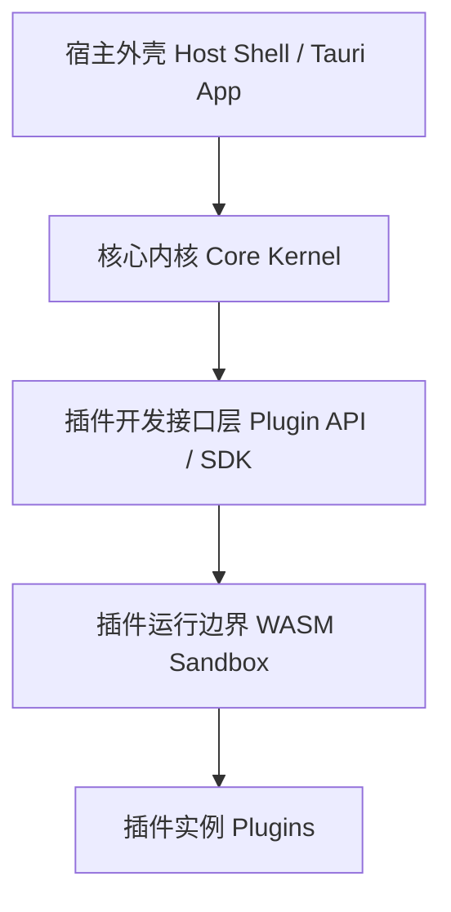
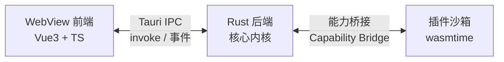
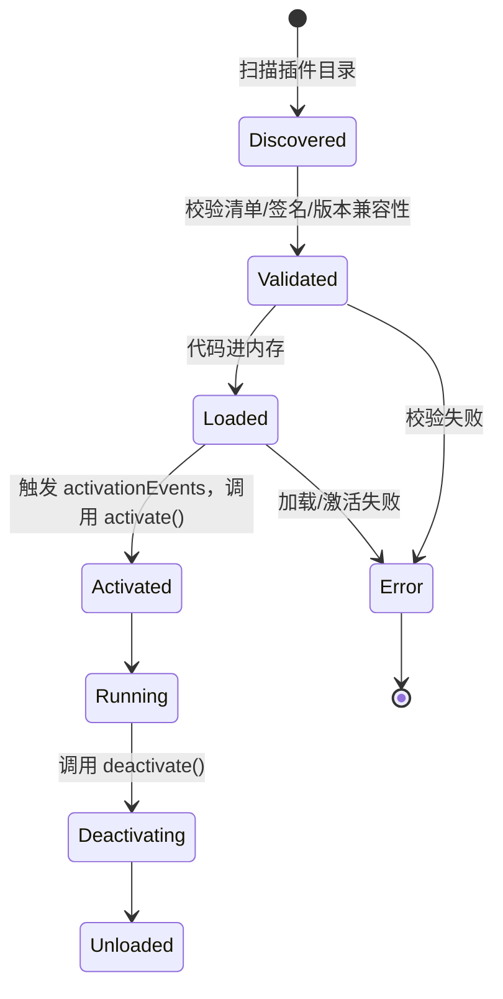

# 桌面插件化工具核心 — 架构设计书

**版本**：v0.1（草案）
**状态**：核心架构已确定，应用领域待细化
**更新日期**：2026-08-20

---

## 1. 概述

### 1.1 目标

设计一个提供标准插件开发接口的桌面工具核心。内核保持薄、稳定、通用，绝大多数业务功能通过插件契约挂载；插件之间、插件与宿主之间的耦合可控、故障可隔离、接口可长期演进。

### 1.2 技术栈

| 层次 | 选型 |
|---|---|
| 桌面应用框架 | Tauri 2 |
| 核心 / 后端语言 | Rust |
| 前端 | Vue 3 + TypeScript |
| 插件隔离 | WASM 沙箱（wasmtime） |
| 本地存储 | SQLite（设置与配置数据） |

### 1.3 选型依据（摘要）

- **Rust + Tauri 2**：团队 C#/C++ 经验都不深，与其分散精力，不如统一投入学习 Rust；额外收益是 Rust 与 wasmtime（本身即 Rust 项目）之间的插件沙箱集成摩擦最小。
- **WASM 沙箱**：在"进程内直接调用 / 进程内沙箱 / 进程外独立进程"三种插件隔离方案中，选择进程内沙箱这一折中方案，兼顾隔离性与实现复杂度；沙箱后端选定 WASM（而非 V8 isolate / QuickJS），因为语言无关、能力安全模型天然、且与 Rust 宿主协同成本最低。
- **Vue 3**：Tauri 对前端框架无感知，选 Vue 3 主要基于团队既有经验，与 React 相比无原则性优劣。

### 1.4 关键决策速览

| 决策点 | 选择 |
|---|---|
| 插件隔离 | 进程内 WASM 沙箱（wasmtime） |
| 桌面框架 | Tauri 2 |
| 核心语言 | Rust |
| 前端框架 | Vue 3 + TypeScript |
| 文件系统权限 | 精确到虚拟目录 |
| 网络权限 | 域名白名单 |
| id 冲突处理 | 拒绝加载 + 报错，不做静默覆盖 |
| 面板系统（MVP） | 简单可停靠面板 |
| 配置存储 | 本地 SQLite，不额外起数据库服务 |
| 插件开发热重载 | 仅重载变更的 WASM 模块 |
| 遥测 / 崩溃上报 | 默认不采集 |
| 插件市场 / 多语言 SDK | TODO，暂不实现 |
| 插件测试脚手架 | TODO，暂不实现 |

---

## 2. 总体架构

### 2.1 分层

自底向上五层：

1. **宿主外壳（Host Shell / Tauri App）**：应用入口、窗口管理、启动与退出流程
2. **核心内核（Core Kernel，Rust）**：插件管理器、扩展注册表、服务注册表、事件总线、权限管理器、配置中心
3. **插件开发接口层（Plugin API / SDK）**：插件必须实现的契约、可声明的扩展点 schema、可调用的宿主服务接口——一旦发布需谨慎变更
4. **插件运行边界（WASM Sandbox）**：wasmtime 承载的独立线性内存空间
5. **插件实例（Plugins）**：具体功能模块



### 2.2 Tauri 进程结构

Tauri 应用是单个操作系统进程，内部三方共存：



两层边界性质不同：WebView ↔ Rust 后端是普通的进程内 API 边界（Tauri IPC）；Rust 后端 ↔ 插件沙箱是安全边界（能力桥接），插件只能看到宿主显式授权的能力。

---

## 3. 插件生命周期



**懒激活（Lazy Activation）**：插件在清单里声明 `activationEvents`，宿主启动时只做扩展点预注册，真正执行插件代码要等激活事件触发，避免启动耗时随插件数量线性增长。

---

## 4. 插件清单（Manifest）

```json
{
  "id": "com.example.myplugin",
  "name": "My Plugin",
  "version": "1.2.0",
  "engines": { "core": "^2.0.0" },
  "main": "plugin.wasm",
  "activationEvents": ["onCommand:myplugin.run"],
  "permissions": [
    { "type": "fs.read", "virtualDir": "workspace" },
    { "type": "network.http", "allowedDomains": ["api.example.com"] }
  ],
  "dependencies": { "com.example.other": "^1.0.0" },
  "contributes": {
    "commands": [{ "id": "myplugin.run", "title": "Run My Plugin" }],
    "menus": { "toolbar": [{ "command": "myplugin.run" }] },
    "views": [{ "id": "myplugin.panel", "name": "My Panel" }],
    "configuration": []
  }
}
```

| 字段 | 说明 |
|---|---|
| `engines.core` | 声明兼容的宿主版本区间（SemVer），加载前校验，不兼容直接拒绝 |
| `main` | 插件编译产物路径，指向 `.wasm` 文件 |
| `activationEvents` | 懒激活触发条件 |
| `permissions` | 声明式权限请求，见第 7 节 |
| `dependencies` | 插件间依赖，用于排定加载顺序、检测循环依赖 |
| `contributes` | 声明式扩展点贡献 |

---

## 5. 核心接口定义

插件以 WASM 组件形式运行，接口通过 WIT（WebAssembly Interface Types）定义，宿主侧用 `wit-bindgen` 生成绑定。

### 5.1 插件侧契约（WIT）

```wit
package host:plugin;

interface plugin-lifecycle {
  activate: func() -> result<_, string>;
  deactivate: func() -> result<_, string>;
}

interface plugin-commands {
  handle-command: func(command-id: string, args: list<u8>) -> result<list<u8>, string>;
}

interface host-services {
  notify: func(level: log-level, message: string);
  read-file: func(virtual-path: string) -> result<list<u8>, string>;
  write-file: func(virtual-path: string, data: list<u8>) -> result<_, string>;
  http-fetch: func(url: string) -> result<list<u8>, string>;
  emit-event: func(topic: string, payload: list<u8>);
  register-command: func(command-id: string) -> result<_, string>;
}

world plugin-world {
  export plugin-lifecycle;
  export plugin-commands;
  import host-services;
}
```

### 5.2 宿主侧类型（Rust）

```rust
pub enum PluginState {
    Discovered,
    Validated,
    Loaded,
    Activated,
    Running,
    Deactivating,
    Unloaded,
    Error { reason: String },
}

pub struct PluginInstance {
    pub plugin_id: PluginId,
    pub manifest: PluginManifest,
    pub state: PluginState,
    // component: 由 wit-bindgen 根据 plugin-world 生成的绑定类型
    // store: wasmtime::Store<HostState>
}

pub struct CoreKernel {
    pub plugin_manager: PluginManager,
    pub extension_registry: ExtensionRegistry,
    pub service_registry: ServiceRegistry,
    pub event_bus: EventBus,
    pub permission_manager: PermissionManager,
    pub config_store: ConfigStore, // SQLite 承载，见第 10 节
}
```

---

## 6. 扩展点机制

分声明式（写在 manifest `contributes` 里）和编程式（`activate()` 时调用 `register-command` 等宿主服务）两种。

**命名空间规则（已决策）**：所有 command id、扩展点 id 强制带插件 id 前缀，格式 `{plugin_id}.{local_name}`，如 `com.example.myplugin.run`。

**冲突处理（已决策）**：注册时 id 已存在 → 拒绝加载该插件并报错，不做静默覆盖。

```rust
/// 命名规则与冲突策略见上文
pub fn register_command(
    &mut self,
    plugin_id: &PluginId,
    local_name: &str,
) -> Result<CommandId, RegistryError>;
```

---

## 7. 权限与安全模型

**文件系统权限（已决策）**：精确到虚拟目录。插件在 manifest 里声明要访问的虚拟目录别名（如 `workspace`），宿主在安装/授权时把别名映射到真实路径，插件既看不到也无法逃逸出映射范围。

**网络权限（已决策）**：精确到域名白名单，manifest 声明允许访问的域名列表，宿主侧的 `http-fetch` 实现负责校验。

**权限 → 能力映射**：manifest 里的 `permissions` 数组在插件实例化时转换为具体能力集合，只把被授权的宿主函数导入到该插件的 WASM 实例里，未授权的能力插件代码里根本"看不见"。

---

## 8. 插件隔离：WASM 沙箱

- **运行时**：wasmtime，每个插件独立线性内存，宿主与插件互不可见对方内存
- **能力桥接（Capability Bridge）**：宿主与插件之间的所有交互都通过第 5 节 WIT 定义的显式导入/导出函数完成
- **资源限额**：fuel 计量限制执行指令数，超时/超额强制中断，错误路由回第 3 节生命周期状态机的 `Error` 分支
- **线程隔离**：插件在独立工作线程执行，避免拖累 UI/主线程
- **局限性**：若能力桥接触达的宿主原生代码本身存在缺陷（如 host 函数内部崩溃），仍可能拖垮整个进程——这是相对"进程外"方案容错天花板更低的地方。若未来某类插件风险显著更高，可以只把这一类挪到独立进程，两种隔离策略可以按插件类型混合，不互斥。

---

## 9. UI 扩展与面板系统

**MVP 方案（已决策）**：简单可停靠面板（docking），参考 VS Code 的模型，不追求过度灵活的自由拖拽布局。插件通过 `views` 声明式贡献面板，具体停靠位置与布局细节留待实现阶段细化。

---

## 10. 配置与存储

**已决策**：插件贡献的配置项统一挂到一个全局设置面板下，按插件分组展示；配置数据存本地 SQLite，不额外起数据库服务。`ConfigStore` 是 `CoreKernel` 的一部分（见第 5.2 节），插件通过 manifest 的 `contributes.configuration` 声明配置项 schema。

---

## 11. 插件开发体验：热重载

**已决策**：开发模式下只重新加载改动的那个 WASM 模块，重走一遍校验 → 加载 → 激活流程，不重启整个 Tauri 应用。这是 WASM 沙箱模型顺带的好处——每个插件本就是独立实例，替换单个实例不影响宿主进程或其他插件。

---

## 12. 版本兼容性

插件 API 走语义化版本（SemVer）。插件通过 `engines.core` 声明兼容的宿主版本区间，加载前校验，不兼容直接拒绝并给出明确错误。废弃 API 需提供过渡期和 warning，不能直接删除。

---

## 13. 打包与分发

**MVP 方案（已决策）**：仅支持本地插件目录——编译好的 `.wasm` + manifest 放进指定目录即可安装，宿主启动时扫描该目录。在线插件市场列入 TODO（见第 15 节）。

---

## 14. 遥测与可观测性

**已决策**：默认不采集任何遥测/崩溃上报数据。未来如确有需要，必须走显式 opt-in，不做静默上报。

---

## 15. 待定事项（TODO）

以下事项已识别但暂不投入实现，按优先级粗排：

| 事项 | 说明 | 阻塞条件 |
|---|---|---|
| 应用领域与目标受众 | 内部工具 vs 面向第三方开放插件市场，决定后续投入优先级 | 尽早明确，但不阻塞核心开发 |
| 插件市场 | 在线插件发现/安装/更新机制 | 待应用领域明确 |
| 多语言插件 SDK | 目前仅 Rust 一等支持（编译到 WASM），WASM 本身语言无关，可扩展 AssemblyScript / TinyGo / C++ 等 SDK | 待应用领域明确、核心稳定后 |
| 插件测试脚手架 | 面向插件开发者的测试工具 / mock host | 待手上有 2-3 个真实插件后再抽象，避免设计过早定型 |
| 面板系统自由布局 | 当前 MVP 是简单 docking，未来是否需要更灵活的自由拖拽布局 | 待用户反馈 |

---

## 16. 项目结构

```
my-app/
├── Cargo.toml               # workspace 定义
├── crates/
│   ├── core-kernel/         # 插件管理器 · 扩展注册表 · 服务注册表 · 事件总线 · 权限管理器
│   ├── plugin-manifest/     # manifest 解析与校验，engines/dependencies 兼容性检查
│   └── sandbox-runtime/     # wasmtime 封装、能力桥接（wit-bindgen）、资源限额
├── src-tauri/                # Tauri 外壳：窗口、菜单，把 core-kernel 接到 Tauri commands
│   └── src/main.rs
└── src/                      # 前端 Vue3 + TS
    └── components/
```

`core-kernel`、`plugin-manifest`、`sandbox-runtime` 独立成 crate、不依赖 Tauri，`src-tauri` 只是把内核接到窗口和 IPC 上的胶水层——以后若要换 UI 外壳或出 CLI 版本，内核原样可用。

---

## 17. 术语表

| 术语 | 含义 |
|---|---|
| 核心内核 Core Kernel | 宿主中管理插件生命周期与提供内部服务的模块集合 |
| 扩展点 Extension Point | 插件可以贡献功能的预定义"插槽"（命令、菜单、面板等） |
| 能力桥接 Capability Bridge | 宿主与 WASM 插件沙箱之间显式、受限的调用通道 |
| 懒激活 Lazy Activation | 插件代码延迟到激活事件触发时才加载执行 |
| 声明式贡献 | 写在 manifest 里、宿主无需执行插件代码即可识别的扩展点贡献 |

---

**下一步建议**：核对本文档无误后，可按第 16 节的 workspace 结构初始化仓库，先把 `core-kernel` 的类型定义和 `src-tauri` 到前端的空壳链路跑通。
